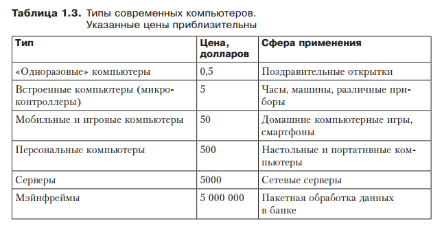

## Виды компьютеров. Микроконтроллеры.

**Микроконтроллер** - это специальная микросхема, предназначенная для управления различными электронными устройствами. Разработчики микроконтроллеров придумали остроумную идею – объединить процессор, память, ПЗУ и периферию внутри одного корпуса, внешне похожего на обычную микросхему.

Все микроконтроллеры можно разделить на два типа: **универсальные** и **специализированные**.
Первые фактически являют собой обычные компьютеры, уменьшенные в размере. Специализированные же микроконтроллеры отличаются индивидуальной архитектурой и набором команд, приспособленными для решения определенного круга задач, например, связанных с воспроизведением мультимедийных данных. 

Виды компьютеров: 

1. **Одноразовые компьютеры.** В самой верхней строчке находятся микросхемы, которые приклеиваются на внутреннюю сторону поздравительных открыток для проигрывания мелодий типа «Happy Birthday», свадебного марша или чего-нибудь подобного.
2. **Микроконтроллеры.** Вторая категория отведена под компьютеры, которыми оснащаются разного рода бытовые устройства. Такого рода встроенные компьютеры, называемые также микроконтроллерами, выполняют функцию управления устройствами и организации их пользовательских интерфейсов.
3. **Игровые компьютеры.** Это, по существу, обычные компьютеры, в которых расширенные возможности графических и звуковых контроллеров сочетаются с ограничениями по объему ПО и пониженной расширяемостью. 
4. **Персональные компьютеры.** Именно они ассоциируются у большинства людей со словом «компьютер». Персональные компьютеры бывают двух видов: настольные и портативные (ноутбуки).
5. **Серверы.** Мощные персональные компьютеры и рабочие станции часто используются в качестве сетевых серверов — как в локальных сетях (обычно в пределах одной организации), так и в Интернете. Серверы, как правило, поставляются в однопроцессорной и мультипроцессорной конфигурациях.
6. **Комплексы рабочих станций.** В последние годы появилась практика объединения рабочих станций в рамках кластеров рабочих станций , которые иногда называют просто «кластерами». Они состоят из нескольких персональных компьютеров или рабочих станций, подключенных друг к другу по высокоскоростной сети и снабженных специальным программным обеспечением, которое позволяет направлять их ресурсы на решение единых задач 
7. **Мэйнфреймы.** Наконец мы дошли до больших компьютеров размером с комнату, напоминающих компьютеры 60-х годов и традиционно называемых мэйнфреймами. Обычно они работают не намного быстрее, чем мощные серверы, но у них выше скорость процессов ввода-вывода и обладают они довольно большим пространством на диске.
