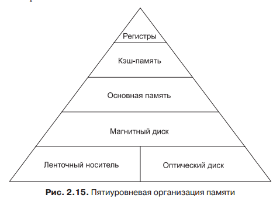

## Основная память. Адресная структура. Виды и особенности адресации. Кэш память. Иерархия уровней памяти.

**Основная память** - это устройство для хранения информации. Она состоит из оперативного запоминающего устройства (ОЗУ) и постоянного запоминающего устройства (ПЗУ).

**ОЗУ** - быстрая, полупроводниковая, энергозависимая память. В ОЗУ хранятся исполняемая в данный момент программа и данные, с которыми она непосредственно работает.

**ПЗУ** - быстрая, энергонезависимая память. ПЗУ - это память, предназначенная только для чтения. 

## Виды и особенности адресации

**Адресация** - Большинство команд работают с операндами, расположение которых необходимо каким-то образом указать. Этот механизм, называется адресацией. 
Режимы адресации:

1. Непосредственная адресация -  самый простой способ указания операнда — хранить в адресной части сам операнд, а не адрес операнда или какую-либо другую информацию, описывающую, где находится операнд.
2. Прямая адресация - этот способ определения операнда — просто дать его полный адрес.
3. Регистровая адресация - по сути напоминает прямую, только в данном случае вместо ячейки памяти указывается регистр.
4. Косвенная регистровая адресация - искомый операнд берется из памяти или отправляется в память, но адрес не фиксируется жестко в команде, как при прямой адресации, а находится в регистре.
5. Индексная адресация: Обращение к памяти по регистру и константе смещения называется индексной адресацией.
6. Относительная индексная адресация  - В некоторых машинах применяется режим адресации, при котором адрес вычисляется путем суммирования значений двух регистров и смещения (смещение факультативно).
7. Стековая адресация: Мы уже отмечали, что очень желательно сделать машинные команды как можно короче. Предельный случай — команды без адресов. Как мы уже знаем, безадресные команды, например IADD, возможны при наличии стека.

**Кэш память** - это высокоскоростная память произвольного доступа, используемая процессором компьютера для временного хранения информации. Она увеличивает производительность, поскольку хранит наиболее часто используемые данные и команды «ближе» к процессору, откуда их можно быстрее получить

### Иерархия уровней памяти 

Часто выделяют 4 основных (укрупненных) уровня иерархии:

1.  Внутренняя память процессора (регистры, организованные в регистровый файл и кэш процессора).
2.  ОЗУ системы (RAM) и вспомогательных карт памяти.
3.  Накопители с «горячим» доступом (On-line mass storage) — или вторичная компьютерная память. Жесткие диски и твердотельные накопители, не требующие длительных (секунды и больше) действий для начала получения данных
4.  Накопители, требующие переключения носителей (Off-line bulk storage) — или третичная память. Сюда относятся магнитные ленты, ленточные и дисковые библиотеки, требующие длительной перемотки либо механического (или ручного) переключения носителей информации.

