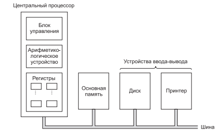

## Архитектура компьютера.

**Архитектура компьютера** - концептуальная структура вычислительной машины, определяющая проведение обработки информации и принципы взаимодействия технических средств и программного обеспечения.

### Архитектура персонального компьютера

Цифровой компьютер состоит из связанных между собой процессоров, модулей памяти и устройств ввода-вывода. 

На рис показана структура обычного компьютера с шинной организацией.
**Центральный процессор** — это мозг компьютера. Его задача — выполнять про-
граммы, находящиеся в основной памяти. Для этого он вызывает команды из
памяти, определяет их тип, а затем выполняет одну за другой. Компоненты
соединены шиной, представляющей собой набор параллельно связанных прово-
дов для передачи адресов, данных и управляющих сигналов. Шины могут быть
внешними (связывающими процессор с памятью и устройствами ввода-вывода)
и внутренними. Современный компьютер использует несколько шин.

Материнская плата, формирующая основу вычислительной системы современного компьютера общего назначения, содержат две основные большие микросхемы:

**Северный мост** - контроллер-концентратор памяти (MCH), который обеспечивает работу центрального процессора с оперативной памятью и видеоадаптером.

**Южный мост**  - контроллер-концентратор ввода-вывода (ICH), обеспечивающий работу контроллеров интегрированных в материнскую плату устройств (локальной вычислительной сети ЛВС, звуковой подсистемы, видеоадаптера в отдельном случае), а также взаимодействие с внешними устройствами, посредством организации шинного интерфейса.

От микросхем чипсета зависят возможности работы установленных в вычислительной системе процессора внешних устройств (видеокарты, винчестера и др.).
