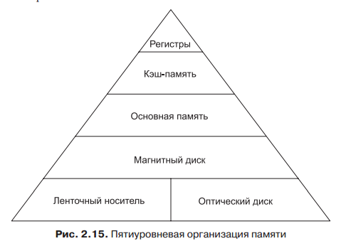
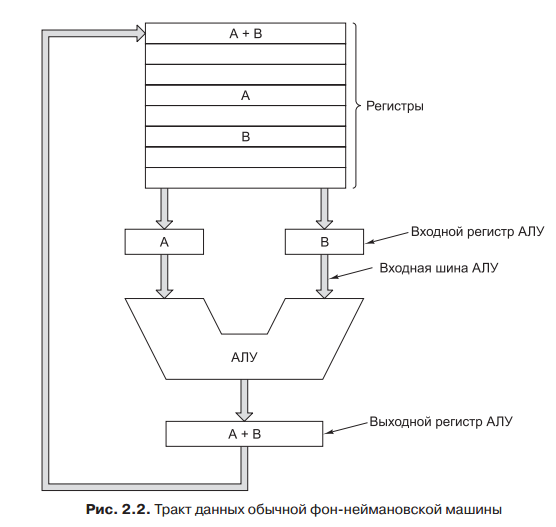

## Память. Процессор. Устройства ввода. Интерфейс.

### Память

**Память** — это тот компонент компьютера, в котором хранятся программы и данные.

Основной единицей хранения данных в памяти является двоичный разряд, который называется **битом**. Бит может содержать 0 или 1. Эта самая маленькая единица памяти.

Память состоит из ячеек, каждая из которых может хранить некоторую порцию
информации. Каждая ячейка имеет номер, который называется **адресом**. Если адрес состоит из `m` бит, максимальное число адресуемых ячеек составит `2^m`. Ячейка — минимальная адресуемая единица памяти. В последние годы практически все производители выпускают компьютеры с **8-разрядными ячейками**, которые называются байтами.  Байты группируются в слова. В компьютере с **32-разрядными** словами на каждое слово приходится **4 байт**, а в компьютере с **64-разрядными** словами — **8 байт**.

### Процессор

**Центральный процессор** — это мозг компьютера. Его задача — выполнять программы, находящиеся в основной памяти. Для этого он вызывает команды из памяти, определяет их тип, а затем выполняет одну за другой.

Процессор состоит из нескольких частей:

**Блок управления** отвечает за вызов команд из памяти и определение их типа.

**Арифметико-логическое устройство** выполняет *арифметические операции* (например, сложение) и *логические операции* (например, логическое И).

Внутри центрального процессора находится **быстрая память небольшого объема** для хранения промежуточных результатов и некоторых команд управления. Эта память состоит из нескольких *регистров*, каждый из которых выполняет определенную функцию.

Внутреннее устройство **тракта данных** типичного фон-неймановского процессора иллюстрирует рис. **Тракт данных** состоит из регистров (обычно от 1 до 32), арифметико-логического устройства (АЛУ) и нескольких соединительных шин. Содержимое регистров поступает во входные регистры АЛУ, которые на рис обозначены буквами A и B. В них находятся входные данные АЛУ, пока АЛУ производит вычисления. АЛУ выполняет сложение, вычитание и другие простые операции над входными данными и помещает результат в выходной регистр. Содержимое этого выходного регистра может записываться обратно в один из регистров или сохраняться в памяти, если это необходимо. Большинство команд можно разделить на две группы: команды типа регистр-память и типа регистр-регистр. Команды первого типа вызывают слова из памяти, помещают их в регистры, где они используются в качестве входных данных АЛУ. Другие команды этого типа помещают регистры обратно в память. Команды второго типа вызывают два операнда из регистров, помещают их во входные регистры АЛУ, выполняют над ними какую-нибудь арифметическую или логическую операцию и переносят результат обратно в один из регистров. Этот процесс называется **циклом тракта данных**.

Последовательность шагов (**выборка — декодирование — исполнение**)
является основой работы всех компьютеров.

### Устройства ввода.

**Устройства ввода** - это, в основном, датчики преобразования не электрических величин (расположение в пространстве, давление, вязкость, скорость, ускорение, освещенность, температура, влажность, перемещение, количественные величины и т.п.) и электрических величин в электрические сигналы воспринимаемые процессором для дальнейшей их обработки в основном в цифровом виде.

* Клавиатура
* Мышь и тачпад
* Планшет
* Джойстик
* Сканер
* Цифровые фото, видеокамеры, веб-камеры
* Микрофон

**Устройства вывода** - это преобразователи электрической цифровой информации в вид необходимый для получения требуемого результата, могущего быть как не электрической природы (механические, тепловые, оптические, звуковые), так и электрической природы (трансформаторы, нагреватели, электродвигатели,реле).

* Монитор
* Графопостроитель
* Принтер
* Акустическая система

### Интерфейс.

**Интерфе́йс** - совокупность унифицированных стандартных соглашений, аппаратных и программных средств, методов и правил взаимодействия устройств или программ, а также устройств или программ с пользователем

#### Способ взаимодействия физических устройств.

**Физический (аппаратный) интерфейс** — способ взаимодействия физических устройств. Чаще всего речь идёт о компьютерных портах.

* Сетевой интерфейс
* Сетевой шлюз — устройство, соединяющее локальную сеть с более крупной, например, Интернетом.
* Шина (компьютер)

#### Способ взаимодействия виртуальных устройств

Для виртуальных (программных) устройств существуют следующие интерфейсы:

* Интерфейс программирования приложений (API) — набор стандартных библиотечных методов, которые программист может использовать для доступа к функциональности другой программы
* Удалённый вызов процедур
* COM-интерфейс
* Интерфейс объектно-ориентированного программирования