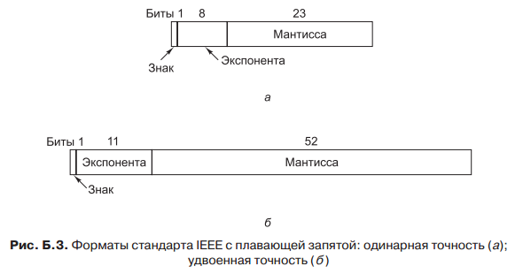

## Формат данных. Текстовые данные. Кодовые таблицы. Unicode. Графические данные. Форматы графических данных. Видео данные. Форматы видео данных. Форматы чисел. Фиксированная и плавающая точка.

**Формат** — спецификация структуры данных, записанных в компьютерном файле.

**Текстовые данные** — представление информации в вычислительной системе в виде последовательности печатных символов.

Текстовыми данными как правило называются последовательности из подмножества знаков, включающего только печатные знаки (буквы, цифры, знаки препинания) и некоторые управляющие знаки (пробелы, табуляции, переводы строки).

**Кодовая таблица** - таблица соответствий символов и их положений в таблице. 

#### Стандарты кодирования символов

##### ASCII

**ASCII** (American Standard Code for Information Interchange — американский стандартный код для обмена информацией). Каждый ASCII символ содержит 7 бит, таким образом, всего можно закодировать **128 символов**. Коды от 0 до 1F соответствуют управляющим символам, которые не печатаются. Коды от 128 до 255 не входят в кодировку ASCIIl, на IBM PC за ними были закреплены специальные символы, которые до сих пор поддерживаются большинством компьютеров. Печатные ASCII-символы включают буквы верхнего и нижнего регистров, цифры, знаки пунктуации и некоторые математические символы.

##### Unicode

**Основная идея Unicode** — приписать каждому символу единственное постоянное **16-разрядное значение**, которое называется кодовым пунктом. Так как Unicode-символы состоят из 16 бит, всего получается **65 536 кодовых пунктов**. 

##### UTF-8

Стандарт Unicode был лучше ASCII, но со временем в нем тоже возникла нехватка кодовых пунктов. Кроме того, он требовал 16 бит для представления «чистого» ASCII-текста, что было расточительно. Для решения этих проблем была разработана новая схема кодирования UTF-8 UCS Transformation Format. Коды UTF-8 имеют переменную длину от 1 до 4 байт, и позволяют кодировать **до двух миллиардов символов**. Этот способ кодировки сейчас доминирует в World Wide Web. Одно из преимуществ UTF-8 заключается в том, что коды от 0 до 127 используются для представления ASCII-символов. Таким образом, одному символу соответствует один байт (вместо двух байтов в Unicode). Для символов, не входящих в набор ASCII, старший бит первого байта устанавливается в 1; это означает, что за ним следуют один и более дополнительных байтов. Всего используются шесть разных форматов.

**Графический формат** — это способ записи графической информации. Графические форматы файлов предназначены для хранения изображений, таких как фотографии и рисунки. 

Графические форматы делятся на *векторные* и *растровые*.

**Векторная графика** представляет изображение как набор геометрических примитивов. Обычно в качестве них выбираются точки, прямые, окружности, прямоугольники, а также, как общий случай, кривые некоторого порядка. 

**Растровая графика** всегда оперирует двумерным массивом (матрицей) пикселей. Каждому пикселю сопоставляется значение яркости, цвета, прозрачности — или комбинация этих значений. Растровый образ имеет некоторое число строк и столбцов.

### Фиксированная точка

Число с фиксированной точкой (англ. fixed-point number) — формат представления вещественного числа в памяти ЭВМ в виде целого числа. При этом само число x и его целочисленное представление x′ связаны формулой

```x = x' * z```,
где z — цена (вес) младшего разряда.

### Плавающая точка

Числа можно выражать в следующей общепринятой экспоненциальной форме:

```n = f × 10^e```

где `f` называется мантиссой, а `e` (это положительное или отрицательное целое
число) — экспонентой. Компьютерная версия такого представления называется
представлением числа с плавающей точкой. 

Область значений определяется по числу разрядов в экспоненте, а точность —
по числу разрядов в мантиссе.


Мантисса с ненулевым крайним левым разрядом называется **нормализованной**.

До 80-х годов каждый производитель поддерживал собственный формат чисел
с плавающей точкой. Все они отличались друг от друга. В 1985 году вышел стандарт **IEEE 754**.

Стандарт **IEEE 754** определяет три формата: с одинарной точностью (32 бита),
с удвоенной точностью (64 бита) и с повышенной точностью (80 бит). Формат
с повышенной точностью предназначен для уменьшения ошибки округления.Форматы представлены на рис.

