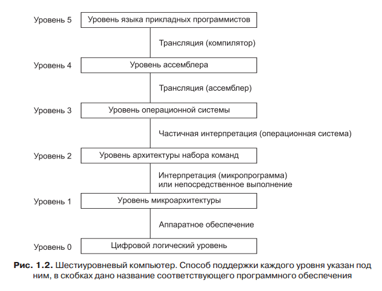

## Машинный язык.  Многоуровневая архитектура. Семантический разрыв.

**Машинный язык** — система команд (набор кодов операций) конкретной вычислительной машины, которая интерпретируется непосредственно процессором или микропрограммами этой вычислительной машины.

Обычно стараются сделать машинные команды как можно проще, чтобы избежать сложностей при разработке компьютера и снизить затраты на необходимую электронику. Большинство машинных языков крайне примитивны, из-за чего писать на них и трудно, и утомительно. Это простое наблюдение с течением времени привело к построению ряда уров ней абстракций, каждая из которых надстраивается над абстракцией более низкого уровня. Именно таким образом можно преодолеть сложности и сделать процесс проектирования систематичным и организованным. Мы называем этот подход **многоуровневой компьютерной организацией**.

**Семантический разрыв** - это мера различия принципов, лежащих в основе языков программирования высокого уровня, и тех принципов, которые определяют архитектуру ЭВМ.

