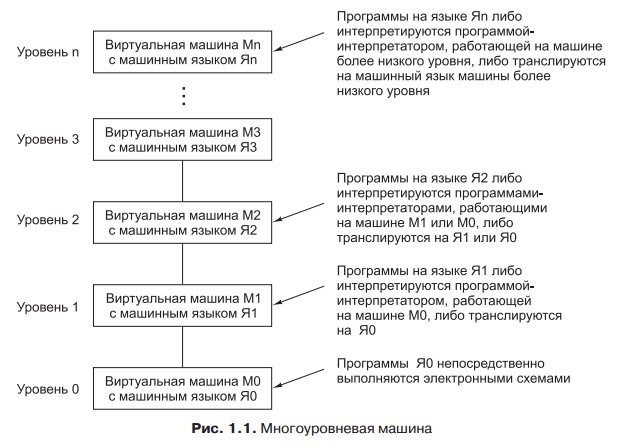

## Языки, уровни и виртуальные машины. Трансляция. Интерпретация.

**Виртуальная машина** - гипотетический компьютер, для которой машинным языком  является язык, которые понимает человек.

Оба способа подразумевают разработку новых команд, более удобных для человека, чем встроенные машинные команды. Эти новые команды в совокупности формируют язык,  который мы будем называть Я1. Встроенные машинные команды тоже формируют язык, и мы будем называть его Я0. Компьютер может исполнять только программы, написанные на его машинном языке Я0. Два способа решения проблемы отличаются тем, каким образом компьютер будет исполнять программы, написанные на языке Я1 — ведь, в конечном итоге, компьютеру доступен только машинный язык Я0. Первый способ исполнения программы, написанной на языке Я1, подразумевает замену каждой команды эквивалентным набором команд на языке Я0. В этом случае компьютер исполняет новую программу, написанную на языке Я0, вместо старой программы, написанной на Я1. Эта технология называется **трансляцией**. Второй способ заключается в создании на языке Я0 программы, получающей в качестве входных данных программы, написанные на языке Я1. При этом каждая команда языка Я1 обрабатывается поочередно, после чего сразу исполняется эквивалентный ей набор команд языка Я0. Эта технология не требует составления новой программы на Я0. Она называется **интерпретацией**, а программа, которая осуществляет интерпретацию, называется интерпретатором.

Изобретение целого ряда языков, каждый из которых более удобен для чело-
века, чем предыдущий, может продолжаться до тех пор, пока мы не дойдем до
подходящего нам языка. Каждый такой язык использует своего предшественника
как основу, поэтому мы можем рассматривать компьютер в виде ряда уровней,
изображенных на рис. 

