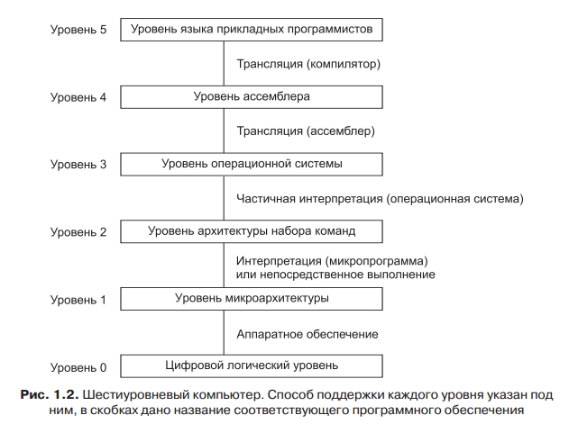

## Цифровой логический уровень. Микроархитектурный уровень. Тракт данных. Микропрограмма.

На самом нижнем уровне, а именно на **цифровом логическом уровне**, объекты называются **вентилями**. Хотя вентили строятся из аналоговых компонентов (таких как транзисторы), они могут быть точно смоделированы как цифровые устройства. У каждого вентиля есть одно или несколько цифровых входных данных (сигналов, представляющих 0 или 1). Вентиль вычисляет простые функции этих сигналов, такие как И или ИЛИ. Каждый вентиль формируется из нескольких транзисторов. Несколько вентилей формируют 1 бит памяти, который может содержать 0 или 1. Биты памяти, объединенные в группы, например, по 16, 32 или 64, формируют регистры. Каждый регистр может содержать одно двоичное число в определенном диапазоне. Из вентилей также может строиться само ядро вычислительной системы. 

Следующий уровень называется уровнем **микроархитектуры**. На этом уровне находятся наборы из (обычно) 8 или 32 регистров, которые формируют локальную память и схему, называемую **АЛУ** (арифметико-логическое устройство). АЛУ исполняет простые арифметические операции. Регистры вместе с АЛУ формируют **тракт данных**, по которому поступают данные. Базовая операция тракта данных выполняется следующим образом: выбирается один или два регистра, АЛУ производит над ними какую-либо операцию (например сложение), после чего результат вновь помещается в какой-либо регистр.

На некоторых машинах работа тракта данных контролируется особой программой, которая называется **микропрограммой**. На других машинах тракт данных управляется напрямую аппаратными средствами.

На машинах, где тракт данных контролируется программным обеспечением,
**микропрограмма** — это интерпретатор для команд на уровне 2. Микропрограмма читает команды из памяти и исполняет их одну за другой, используя при этом тракт данных. Например, при исполнении команды ADD она вызывается из памяти, ее операнды помещаются в регистры, АЛУ вычисляет сумму, а затем результат направляется туда, где он должен находиться. На компьютере с аппаратным управлением тракта данных происходит такая же процедура, но при этом нет программы, интерпретирующей команды уровня 2.

