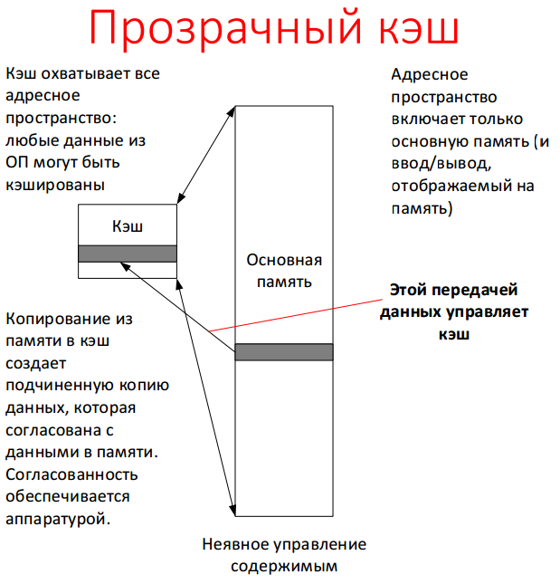
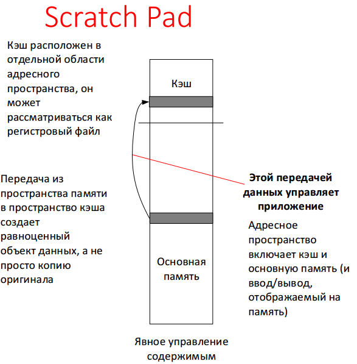
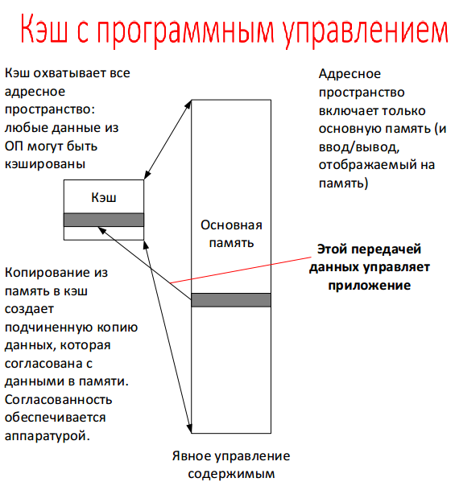
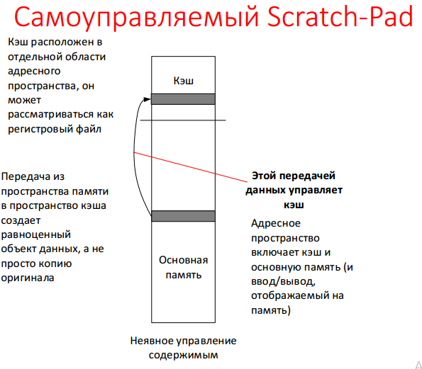

# 14. Классификации кэшей. Оптимизации кэшей: аппаратные и программные.

## Классификация кэшей по логической организации

Параметры классификации:

1. Схема адресации. Прозрачные для пользователя кэши используют схему адресации ОП: программа обращается к кэшу неявно и даже не обязательно знает о его наличии. Буферная память (scratch-pad), напротив, использует отдельное адресное пространство – программа адресует кэш явно. Прозрачные кэши требуют наличия ключей или тегов, для указания, что за данные в них сохранены. Scratch-pad такого не требует.
2. Схема управления. Управление содержимым традиционных кэшей осуществляется прозрачно для приложения: при попытке доступа к ячейке, она загружается в кэш. Scratch-pad требуют явного управления, т. е. приложение само загружает то, что ему требуется.

Указанные параметры определяют 4 базовых типа кэшей:

1. Прозрачный кэш;
2. Scratch-Pad;
3. Кэш с программным управлением;
4. Самоуправляемый Scratch-Pad;

## Категории оптимизаций

Среднее время доступа = доля попаданий * время доступа к кэшу + доля промахов * стоимость промаха;
Среднее время доступа = h*c + (1-h)*m.

Исходя из формулы все оптимизации можно разделить на три категории:

1. Сокращающие долю промахов: увеличение размера строки кэша, увеличение объема кэша, повышение ассоциативности.
2. Сокращающие стоимость промаха: многоуровневые кэши, кэши отдающие чтению более высокий приоритет, чем записи.
3. Сокращающие время при попадании в кэш: механизмы, не использующие трансляцию адреса

## Типы промахов кэша

1. Вынужденные (compulsory, cold start misses, compulsory line fills): Такие промахи возникают при первом обращении к блоку. В связи с тем, что эти блоки еще не были загружены в кэш, все варианты кэш-систем будут испытывать подобные промахи.
2. Промахи из-за емкости (capacity misses): Эти промахи появляются из-за ограниченной емкости кэша. Из-за того, что в кэше недостаточно места для сохранения всех блоков, на которые осуществляются ссылки, некоторые из них приходится выгружать, даже несмотря на то, что они, вероятно, скоро будут использованы. 
3. Промахи из-за конфликтов (collision misses): возникают из-за конфликтов прямой функции отображения или многовходовой ассоциативной функции.

## Пути сокращения доли промахов

1. Увеличение размера строки кэша;
2. Повышение объема кэша;
3. Повышение ассоциативности;
4. Аппаратная предвыборка.

### Увеличение размера строки

Важнейший фактор, оказывающий влияния на вынужденные промахи – это размер строки. Увеличение размера строки создает эффект предвыборки по дополнительным адресам, что может оказаться полезным из-за пространственной локализации обращения к памяти программы. Однако после увеличение размера строки больше определенного предела количество промахов начинает расти. Рост отчасти обусловлен тем, что выгружаются из кэша также большие строки, т. е. выгружаются данные, которые в случае меньшего размера строки остались бы в кэше.

### Повышение объема кэша

* Повышение объема кэша позволяет сократить промахи из-за емкости.
* Но это имеет цену. Большие кэши требуют больше пространства на кристалле и потребляют большую мощность. Большие кэши увеличивают время обращения. Все это снижает производительность.
* Метод особенно популярен при разработке внешних кэшей.

### Повышение степени ассоциативности

Повышение степени ассоциативности позволяет сократить количество промахов из-за конфликтов. Однако увеличивает цену и энергопотребление, также может повышаться время доступа.

Наблюдения:

8-входовой ассоциативный кэш для практических применений сравним по эффективности с полностью ассоциативным. 2. 2 к 1: кэш прямого отображения размера N сравним по доле промахов с двухвходовым ассоциативным кэшем размера N/2.

### Аппаратная предвыборка

* Потоковый буфер (Stream Buffer) – это аппаратная очередь между L1 и L2.
* Процессор Alpha 21164 загружает сразу два блока инструкций при промахе, дополнительный блок сохраняется в потоковом буфере. При промахе проверяется потоковый буфер.
* 1 буфер позволил избежать 25% промахов 4 Кб кэша;  4 буфера – 43%;

## Сокращение стоимости промаха

### Многоуровневые кэши

* В этом случае кэш первого уровня работает со скоростью процессора. Кэш второго уровня имеет большую вместимость, для сокращения стоимости промаха.
* Проектирование направлено на балансировку быстроты попаданий и доли промахов.

### Приоритет чтению перед записью

Возможна ситуация, когда кэш удалил запись, но запись ещё находится в буфере записи, а не в памяти. Если в это время будет осуществлен доступ, то может быть считано неверное значение. Решением будет проверка содержимого буфера записи и считывание из него, т. е. приоритет чтению.

## Сокращение времени попадания

Отказ от использования трансляции адреса в ходе определения индекса в кэше. Кэш может избежать трансляции виртуального адреса в физический, если для индексирования использовать смещение на странице (page offset). Недостатки: проблемы с синонимами; размер смещения ограничивает размер кэша

## Оптимизации, выполняемые компилятором и программным обеспечением

1. Использование специальных инструкций предвыборки. При этом данные инструкции не должны вызывать конфликтов, т. к. это форма спекулятивного выполнения. Особенно эффективно вместе с циклами после разворачивания.
2. Объединение массивов для увеличения пространственной локальности.
3. Изменение порядка вложенных циклов.
4. Объединение разных циклов.
5. Разбиение циклов на блоки (введение внутреннего цикла с числом итераций, позволяющим не выходит за размеры кэша), с целью увеличения локальности
