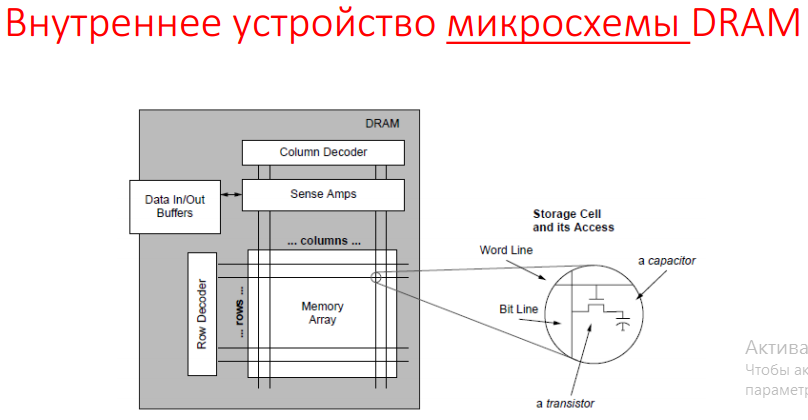
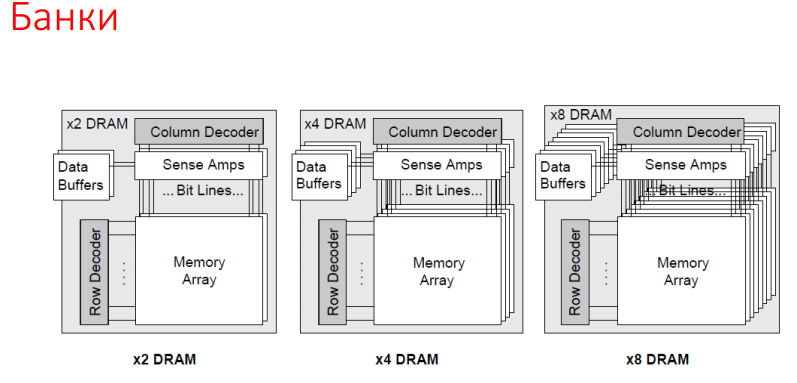
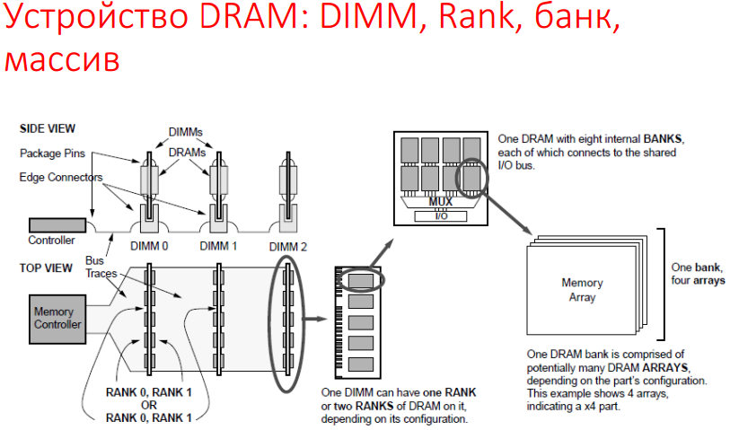

# 15. Внутреннее устройство и функционирование ОЗУ. Цикл памяти.

## Цикл памяти

* Циклом памяти называется последовательность действий, которые выполняются в процессе чтения кода из микросхемы памяти или записи в нее нового кода.
* Время доступа памяти представляет собой задержку начала получения данных из памяти относительно появления запроса на них.

### Доступ к памяти

Шаги при чтении:

A. Ожидание транзакции в очереди процессора.
B. Отправка запроса контроллеру памяти.
C. Трансляция запроса в последовательность команд (возможно с помещением в
очередь).
D. Отправка команд DRAM.
A. Отправка ответа процессору.            
Время доступа = A + B + C + D + E + F.

### Операция чтения

* Получив от процессора адрес, контроллер памяти определяет и активирует нужный
dimm, rank, чип, банк, массив, строку и столбец.
* Затем нужный банк предзаряжается (линии битов bitline устанавливаются в
значения, промежуточные между 0 и 1).
* При активации word line все конденсаторы одной строки соединяются с bit line.
Специальная усилительная схема используется для определения хранимого значения. Сначала она транслирует промежуточное (между 0 и 1) значение на bit line, конденсатор немного изменяет его в соответствии с хранимым зарядом,
изменение фиксируется усилительной схемой и передается на выход.
* Затем на конденсатор подается полное значение (0 или 1, хранившееся ранее),
которое перезаряжает его.

