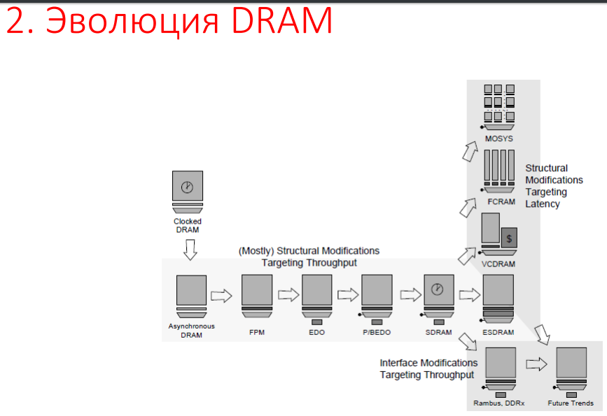

# 16. Эволюция ОЗУ. Атаки на ОЗУ. Контроль и диагностика ОЗУ.

## Атаки на ОЗУ

* Наведение ошибок (Fault-Injection Attack) – атака, направленная на изменение содержимого памяти. Осуществляться может даже с использованием обычной лампы накаливания. Повышенная температура вызывает изменение содержимого отдельных ячеек в словах памяти.
* Атака методом холодной перезагрузки (Cold-Boot Attack) – класс атак по сторонним каналам, при которых злоумышленник, имеющий физический доступ к компьютеру может извлечь из него ключи шифрования или ценные данные. Атака требует полной перезагрузки компьютера либо выключения и изъятия из него модулей памяти. В атаке используется эффект сохранения данных в ОЗУ типа DRAM и SRAM после выключения питания. Данные частично сохраняются в течение периода от нескольких секунд до минут

## Ошибки памяти

* Неисправность (Hard Failure) – это постоянный физический дефект, такой, что ячейка или ячейки не могут нормально сохранять данные, а зависают в одном из значений или переключаются с ошибкой. Неисправность может вызываться жесткими условиями эксплуатации, дефектами изготовления или износом.
* Ошибка – это случайное, неразрушающее событие, которое изменяет содержимое одной или более ячеек памяти без повреждения самой памяти. Ошибки вызываются проблемами подачи напряжения, альфа-частицами.

### Коды, обнаруживающие и исправляющие ошибки

**Коды Хэмминга:**

* Бит 1 проверяет позиции 1, 3, 5, 7, 9, 11 и т. д.
* Бит 2 проверяет позиции 2, 3, 6, 7, 10, 11 и т. д.
* Бит 4 проверяет позиции 4, 5, 6, 7, 12
* Бит 8 проверяет позиции 8, 9, 10, 11, 12, 13, 14 и т. д.

Пример:

10011010             
_ _ 1 _ 0 0 1 _ 1 0 1 0               
011100101010 – исходное слово                 
011100101110 – слово с ошибкой, вычисляются биты четности, сумма
позиций этих битов дает позицию ошибки (2 + 8 = 10).