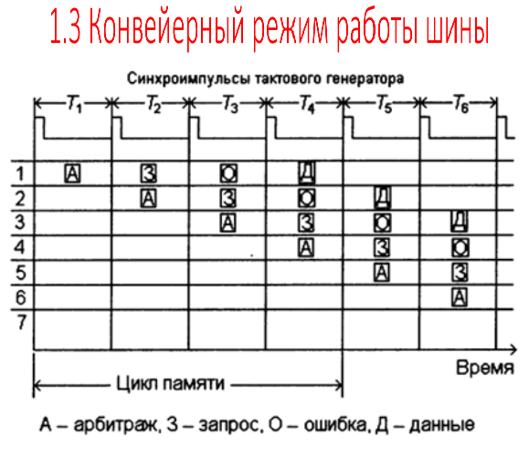

# 18. Арбитраж. Конвейерный режим шины. Многошинная архитектура.

## Арбитраж: определения

* Инициатор (Master) – ведущее устройство, инициирующее передачу данных.
* Ведомое устройство (Slave) – подчиненное устройство.
* Драйвер шины (Bus Driver) – цифровой усилитель, через который мастер подключается к шине.
* Приемник шины (Bus Receiver) – схема, с помощью которой к шине подключается slave.
* Приемопередатчик (Bus Transceiver) – схема, с помощью которой к шине подключаются устройства, которые в разные моменты выполняют роль Master и Slave.

## Арбитраж

* Арбитр – устройство, разрешающее конфликты доступа к шине.
* Протокол – набор правил, которым должны подчиняться все устройства, подключаемые к шине.

Виды арбитража:

1. Статический – доступ к шине осуществляется в заранее определенном порядке. Прост в реализации, неэффективен, не отражает нужд пользователей шины.
2. Динамический – осуществляется по требованию мастера. Для реализации необходимо, чтобы у каждого мастера были линии запроса шины (request) и разрешения шины (grant). Если мастеру требуется шина, устанавливается сигнал на линию request. Транзакция может быть начата только после получения разрешения по линии grant.

## Организация

Организация арбитража:

1. Централизованная: центральный арбитр принимает все запросы на получение шины.
2. Распределенная (децентрализованная): аппаратура арбитража распределена среди всех Master-устройств.

## Многошинная архитектура

Одна шина оказалась не способна обеспечить эффективную передачу всех возможных данных и сигналов. Поэтому современные ПК обычно содержат несколько шин: 

1. Шину низкоскоростных внешних устройств (мышь, принтер);
2. Шину высокоскоростных внешних устройств(магнитные, оптические диски);
3. Шину графического адаптера.
4. Системную шину (шину оперативной памяти);
5. Шину кэша (связывает процессор и внешний кэш); Архитектура компьютеров, в составе которых имеется более одной шины, называется многошинной.
