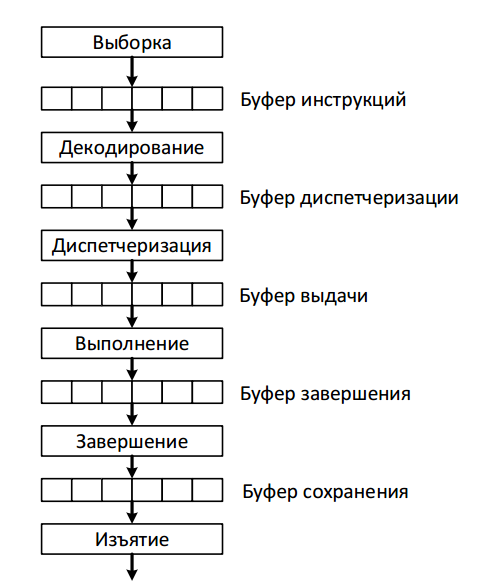

# 25. Суперскалярная архитектура. Скалярные конвейеры, параллельные конвейеры, диверсифицированные конвейеры. Вопросы разработки суперскалярных конвейеров.

Идеи использования нескольких функциональных модулей и первые реализации появились в 1960-ых. Скалярные конвейерные архитектуры имеют ряд ограничений, которые требовалось преодолеть для дальнейшего увеличения производительности. Концепция суперскалярных процессоров идет дальше одного конвейера. Здесь используется несколько функциональных модулей и возможность выполнения инструкций не по порядку.

## Ограничения скалярных конвейеров

**Скалярный конвейер** – это конвейер из k стадий, на каждой из которых может присутствовать не более одной инструкции. Все инструкции независимо от типа проходят через одни и те же стадии. За исключением простоев, каждая инструкция находится на каждой стадии в течении одного такта. 

Ограничения:

1. Максимальная пропускная способность такого конвейера ограничена одной инструкцией за такт. Конвейеры, содержащие более одной инструкции на каждой стадии, называют параллельными.
2. Унификация всех типов инструкций в один конвейер ведет к неэффективному проектному решению. Параллельные конвейеры, имеющие несколько обрабатывающих устройств или субконвейеров называют диверсифицированными конвейерами.
3. Потери производительности из-за жесткой организации: простои приводят к появлению «пузырей». Параллельные конвейеры, в которых инструкции могут «обходить» инструкцию, вызвавшую простой, т.е. конвейеры, поддерживающие внеочередное выполнение, называют динамическими конвейерами.

Суперскалярные конвейеры ослабляют указанные ограничения. Такие конвейеры представляют собой параллельные диверсифицированные динамические конвейеры

## Вопросы разработки суперскалярного конвейера

### Стадия Fetch

В отличие от обычного (скалярного) конвейера в суперскалярном на данной стадии осуществляется выборка сразу s инструкций из кэша инструкций (где s – ширина конвейера).Производительность всех остальных стадий зависит от числа инструкций, выбираемых на данной стадии, и не превышает ее. 

Возникают две проблемы:

1. рассогласование размещения инструкций в кэше;
2. инструкции изменения потока выполнения (инструкции переходов и т.д.).

Для решения первой проблемы может использоваться компилятор или
аппаратура для динамического переразмещения инструкций в кэше.

Решения второй проблемы рассматривались ранее.

### Стадия Decode

Стадия Decode осуществляет

1. идентификацию отдельных инструкций (границ),
2. определение их типов,
3. определение зависимостей между ними.

Сложность стадии определяется архитектурой команд и шириной конвейера. 

В случае суперскалярных RISC-архитектур стадия включает определение зависимостей, раннее декодирование инструкций переходов.

В случае CISC-архитектур стадия очень сложна и разбивается на несколько стадий.

Для увеличения производительности используются агрессивные оптимизации: предекодирование. В случае предекодирования часть операций стадии декодирования выполняются при загрузке инструкций в кэш. Т.е. в кэше хранятся уже предварительно декодированные инструкции промежуточного формата. Дополнительно такой подход позволяет рано обнаруживать инструкции переходов.

Недостатки: увеличение размера кэша, увеличение стоимости промаха (возрастает время обращения).

### Стадия Dispatch

После декодирования инструкция должна быть направлена в соответствующий функциональный модуль для выполнения.

После декодирования, пока некоторые значения ещё не загрузились, инструкции сохраняются в станциях резервирования (временный буфер для инструкций). Если на стороне источника используется один буфер, такая конструкция называется централизованной станцией резервирования. Команды диспетчеризируются из этой станции.

Возможна ситуация, когда сначала осуществляется диспетчеризация, а уже в ходе нее команды записываются в распределенные станции резервирования, установленные рядом с каждым функциональным модулем.

Существуют гибридные подходы.

Компромисс ищется между сложностью оборудования и полнотой его использования.

В случае централизованной станции диспетчеризация совпадает с выдачей. В случае распределенных сначала происходит диспетчеризация нужному устройству, а затем, позже выдача инструкции на выполнение.

### Стадия Execute

Тенденция к увеличению диверсификации и параллельности.

Многие функциональные модули на этой стадии делаются конвейеризированными.

Также используется пространственный параллелизм (дублирование модулей).

Существует проблема межсоединений модулей.

Сложность этой стадии растет практически квадратично числу функциональных модулей.

Важность представляет подбор количества модулей и их типов. Здесь может помочь статистика: типичная программа содержит 40% инструкций АЛУ, 20% ветвлений, 40% инструкций загрузки сохранений.

### Стадии Complete и Retire

Завершение (Completion) – изменения состояния машины, вызванные инструкцией, вступают в силу.

Изъятие (Retire) – изменения памяти вступают в силу.

На стадии Complete инструкции переставляются в начальный порядок. Это нужно для поддержки точных прерываний.