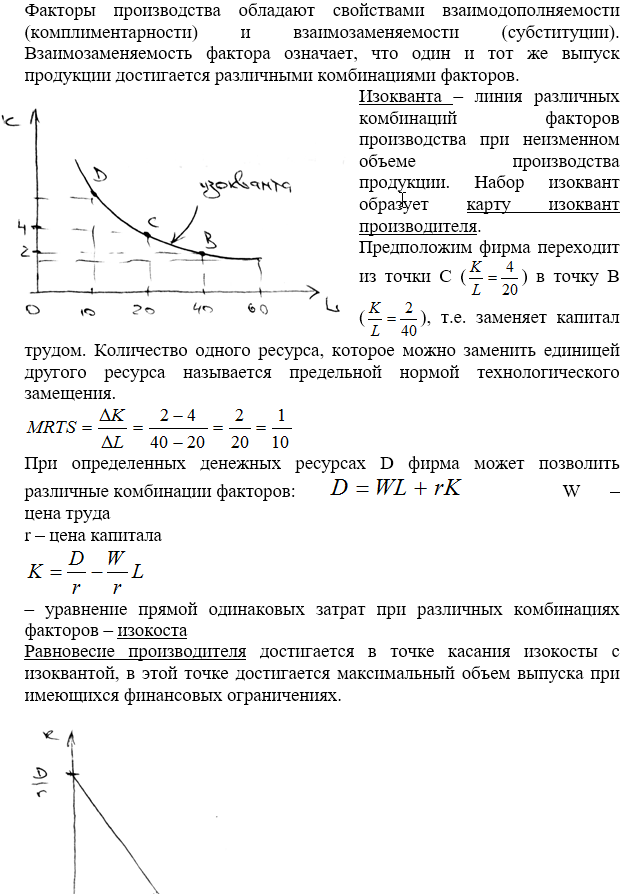

# 21. Производство с двумя переменными факторами. Производственная функция, изокванта, изокоста.

**Изоквантой** называется геометрическое место точек, соответствующих всем комбинациям двух ресурсов, способным произвести заданный объем продукта.
Следует заметить, что факторы обладают взаимозаменяемостью. Она обусловлена разнообразными потребительскими свойствами продукта. В результате возможно любое производство продукта или блага при использовании различных факторов в разнообразных сочетаниях и разнообразных пропорциях. Взаимозаменяемость факторов обусловлена главным образом, ограниченностью ресурсов, с одной стороны, и эффективностью их использования — с другой. Предприниматель выбирает такую технологию производства, при которой дефицитный или сравнительно дорогой фактор используется в меньшей мере.
**ПРЕДЕЛЬНАЯ НОРМА ТЕХНОЛОГИЧЕСКОГО ЗАМЕЩЕНИЯ** — количество одного ресурса (фактора производства), которое требуется для замены единицы другого ресурса без изменения объема выпуска (т. е. при движении вдоль изокванты).
Взаимодополняемость факторов означает, что один из них обязательно дополняет другой и предполагает их только совместное, одновременное использование, отсутствие какого-нибудь фактора приводит к остановке процесса производства.
Пример изокванты:
 
**Изокоста** - линия, демонстрирующая комбинации факторов производства, которые можно купить за одинаковую общую сумму денег (линией равных издержек). Изокосты являются параллельными прямыми, поскольку допускается, что фирма может приобрести любое желаемое количество факторов производства по неизменным ценам. Наклон изокосты выражает относительные цены факторов производства.
Бюджетные ограничения обусловлены наличием ограниченного количества денежных средств в бюджете. Точка, в которой изокванта касается (но не пересекает) изокосты, означает наиболее дешевую по стоимости комбинацию факторов, необходимых для выпуска определенного объема продукта.
 
**Правило наименьших издержек** - производство любого продукта обеспечивает наименьшие издержки в соотношении ресурсов в том случае, если предельный продукт каждого вводимого фактора производства один и тот же:
**Правило максимизации прибыли** - фирма применяет соотношение ресурсов, обеспечивающее максимальную прибыль, если цена на каждый ресурс равна его предельному продукту в денежном выражении:
