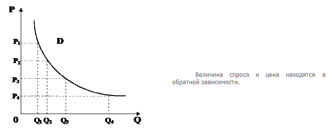

# 24. Спрос. Неценовые факторы спроса. Кривая спроса. Закон спроса.

**Спрос** – желание и способность потребителей приобрести какой-либо товар (платежеспособная потребность)

Различают индивидуальный и рыночный спрос.

**Индивидуальный спрос** – количество товара, которое желает и способен приобрести отдельный покупатель на рынке готовой продукции.
**Рыночный спрос**– совокупный спрос всех покупателей на рынке конкретного товара.
Спрос конкретного товара реализуется через величину спроса.
Спрос – D. Величина спроса = Q^D
**Величина спроса** – количество товара, приобретенного на рынке на определенный момент времени при определенном уровне цены на этот товар.
На величину спроса оказывают влияние различные факторы, и зависимость между величиной спроса и влияющими на нее факторами называется функцией спроса.
Q^D = f( PA,  PS,  PC, T, I, S, N, R )
PA – цена товара
PS – цена товара субститута (взаимозаменяемый товар)
PC – цена товара-дополнителя
T – вкусы и привычки потребителя
I – доход потребителя
S – сезонная потребность в товаре
N – количество покупателей на рынке
R – реклама товара
Рассмотрим влияние цены товара на величину спроса
Q^D = f( PA )

 
Эту зависимость отображает экономический закон спроса.
Закон спроса не всегда действует:

1. Ажиотаж
2. Закон Веблера (на рынке появляется группа дорогих товаров и покупателей, которым параллельно какая цена)
3. Эффект Гиффена ( товары первой необходимости )

Закон спроса объясняется двумя причинами:
1. Убывающая предельная полезность
2. Наличие эффекта дохода и эффекта замещения

Эффект дохода проявляется в том, что при понижении цены на данный товар в неизменном номинальном доходе, реальный доход увеличивается.
**Номинальный доход** – количество денег, которое имеет покупатель
**Реальный доход** – количество товаров и услуг, которые можно приобрести на величину номинального дохода при сложившимся уровне цен.
Эффект замещения проявляется в том, что изменение цены одного товара вызывает изменение спроса на товар-заменитель в том же направлении (только для товаров заменителей)
