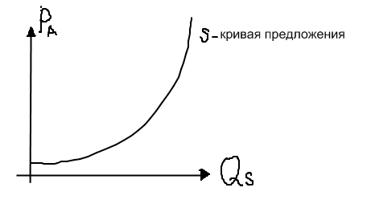

# 25. Предложение. Неценовые факторы предложения. Закон предложения.

Предложение (или готовность производителей продать товар) = S.
**Величина предложения** = Q^S – это количество товаров, которое предлагает продавец (производитель по конкретной цене на определенный товар). Факторы, влияющие на предложение:
QS = f( PA, T, S, Q, W ) – функция предложения – зависимость между предложением и влияющими на него факторами
P¬A  - цена товара
Т – налоги
S – субсидии (пособие) и дотации(то же самое)
Q – производительность труда
W – цены на экономические ресурсы
Рассмотрим влияние цены на предложение
Q^S = f( PA )

Чем выше цена, тем выше величина предложения. Зависимость между величиной предложения и ценой – прямая. Эту зависимость выражает закон предложения.
**Цена спроса**– максимальная цена( определяемая доходом покупателя ), по которой покупатель еще готов приобрести данный товар.
**Цена предложения** – минимальная цена, по которой производитель уже готов продать товар.
