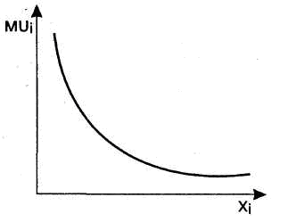

# 26. Потребитель в рыночной экономике. Оценка потребителя в теории кардиналистов. Правило максимизации.

**Потребитель** – это главная фигура рыночной экономики, в условиях которой он суверенен, т.е. независимо от производителя принимает решения о структуре покупок и объеме на рынке готовой продукции.
Вопросы, стоящие перед потребителем:

1. Что купить? (требует анализа: 1)Потребности и степени ее важности, 2) Полезность товара для потребителя).
2. Сколько купить? (требует анализа: 1) Цены товара 2) Наличие товаров-заменителей и цены на них ).
3. Хватит ли денег? (требует анализа: 1) Доход потребителя 2) Источник его формирования).
**Полезность, цена и доход** – основное содержимое теории поведения потребителя. Суть теории такова: каким образом потребители будут расходовать свои денежные доходы между различными товарами и услугами, которые они могут купить. Чтобы это понять, необходимо проанализировать факторы, влияющие на поведение потребителя.

**Кардиналистская (количественная) полезность** - субъективная полезность, или удовлетворение, которую потребитель получает от потребления благ, измеренное в абсолютных величинах. Имеется в виду, что можно измерить точную величину полезности, которую потребитель извлекает из потребления блага. Эту теорию разделял А. Маршалл. Экономисты считали, что полезность можно измерить в условных единицах - **ютилах**.
Оценка в ютилах полезности любого потребляемого блага, набора благ может быть выражена в виде функции общей полезности:
**TU=F(QA,QB,...,QZ)**,
где TU - общая полезность данного набора благ; QA, QB, ..., Qz - объемы потребления благ А, В,..., Z в единицу времени.
**Предельная полезность** — это полезность, которую человек получает от использования ещё одной дополнительной единицы блага.
Закон убывающей предельной полезности утверждает, что в непрерывном акте потребления предельная полезность блага начинает уменьшаться. Отсюда следует необходимость понижения цены для того, чтобы побудить потребителя к увеличению покупок такого продукта.

**Правило Максимизации** - правило, согласно которому любая вложенная сумма денег должна приносить равную предельную полезность.
MUi – предельная полезность, Xi – количество потребленных благ.

