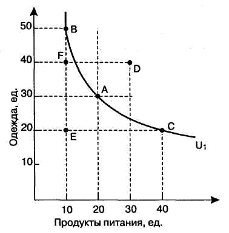

# 27. Вкусы и предпочтения потребителя. Оценка поведения, потребителя в ординалистской теории.

Наряду с общими принципами выбора рационального потребителя существуют особенности, которые  определяются влиянием на выбор вкусов и
предпочтений.

Можно выделить следующие 3 типичных особенности:

1. **Подражание большинству**.
2. **Эффект Сноба**.
3. **Эффект Веблена**.

1. Потребитель стремиться не отстать от других, покупает то, что покупают
другие.  Он  зависит от мнения других потребителей и эта  зависимость
прямая.
2. При эффекте Сноба доминирует стремление выделиться из толпы. Потре¬
битель зависит от выбора других, но эта зависимость обратная.
3. Эффект Веблена показывает престижность потребления. Товары и услуги
используются не по прямому назначению, а для того, чтобы произвести
неизгладимое впечатление на других.

В последней трети 19 столетия появляется ординалистическая теория, объясняющая   поведение покупателя на рынке. В числе ее создателей был Эдтварт и др. Они предположили возможность определения покупности различных товаров косвенным путем с помощью кривых безразличия.

Кривая безразличия изображает совокупность наборов, между которыми потребитель не делает различий. Любой набор на кривой обеспечит один и тот же уровень удовлетворения. Иными словами, кривая безразличия изображает альтернативные наборы благ, которые доставляют одинаковый уровень полезности 

Кривые безразличия обладают следующими свойствами.

1. Кривая безразличия, расположенная справа и выше другой кривой, является более предпочтительной для потребителя.
2. Кривые безразличия всегда имеют отрицательный наклон, ибо рационально действующие потребители будут предпочитать большее количество любого набора меньшему.
3. Кривые безразличия имеют вогнутую форму, обусловленную уменьшающимися предельными нормами замещения.
4. Кривые безразличия никогда не пересекаются и обычно показывают уменьшающиеся предельные нормы замещения одного блага на другое.
5. Наборы благ на кривых, более удаленных от начала координат, предпочтительнее наборам благ, расположенным на менее удаленных от координат кривых.