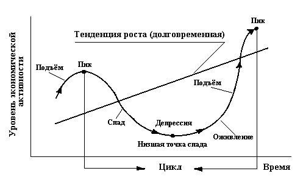

# 36. Безработица. Её причины и формы. Социально-экономические последствия. Закон Оукена.

**Безработица** -  макроэкономическое явление, которое определяет индекс нищеты населения. Полная занятость невозможна.
Причины:

* несоответствие между спросом и предложением на рынке.
* недостаточность совокупного спроса (по Кейнсу).

Типы безработицы:

* фрикционная (связана с поисками и ожиданием работы).
* структурная (связана с технологическими сдвигами в производстве)
* циклическая (связана с кризисами).

Фрикционная + структурная + циклическая = Недовыпуск ВНП (отставание!)

естественная           Оказывает самое сильно влияние
безработица
(4-6 %)

Закон Оукена:

Если уровень безработицы превышает естественный уровень на 1%, то ВНП снижается на 2,5%.
1 % цикл.пр-ва = недовыпуск 2,5% ВНП.

Государственные методы ликвидации безработицы:

1. Активные (создание дополнительных рабочих мест, обеспечение системы переподготовки кадров  и т.д.)
2. Пассивные(создание системы социального страхования и помощи безработным).

