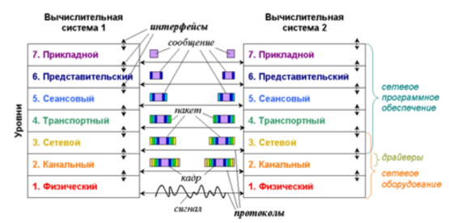

# 1. Модель OSI.

**Коммуникационная сеть** – система каналов связи и коммутационного оборудования для передачи информации с минимальным количеством ошибок и искажений.

**Компьютерная сеть** – вид коммуникационной сети для обмена данными между вычислительными устройствами.

**Сетевой протокол** – набор правил и действий для соединения и обмена данными между двумя и более включёнными в сеть устройствами.

Сети построены на основе открытых спецификаций, открыты для расширения и взаимодействия(открытая система).

**Международная Организация по Стандартам (International Standards Organization, ISO)** разработала модель, которая определяет различные уровни 
взаимодействия систем, дает им стандартные имена и указывает, какую работу должен делать каждый уровень. Эта модель называется **моделью взаимодействия открытых систем (Open System Interconnection, OSI)** или моделью ISO/OSI.
Модель взаимодействия открытых систем (OSI) принята Международной организацией по стандартизации (ISO) в **1983 г**.

Протоколы работают друг с другом в стеке – протокол, располагающийся на уровне выше, работает «поверх» нижнего, используя механизмы инкапсуляции.

## Уровни OSI

1. **Физический уровень** – аппаратура подключения к сети. Этот уровень обеспечивает взаимодействие со средой передачи данных на уровне сигналов (ADSL, USB)
2. **Канальный уровень** осуществляет логическое управление физическими устройствами и повышение достоверности передачи – контроль и исправление ошибок. Оперирует кадрами (PPP, IEEE 802.2)
3. **Сетевой уровень** организует поиск адресов в сети и перенаправление передаваемых адресованных данных (маршрутизация). Оперирует пакетами (IPv4 или просто IP, IPv6)
4. **Транспортный уровень** выполняет передачу от одной точки (адреса) к другой с необходимым контролем и (возможно) дополнительным сервисом. Оперирует пакетами (TCP, UDP)
5. **Сеансовый уровень** обеспечивает установление соединений (сеансов) между взаимодействующими системами (процессами) и управление сеансами (RPC)
6. **Уровень представления** служит для преобразования форматов данных (например, вид кодировки) в соответствии с правилами ПО следующего 7-го уровня (ASCII, JPEG)
7. **Прикладной уровень** – конечные приложения, как чисто прикладные (программы пользователя), так и служебные (т. н. службы или сервисы). Оперирует сообщениями (HTTP, FTP, SMTP, POP3)

Уровни 1-4 это транспортная система. Для вышестоящих уровней транспортный уровень создает так называемые порты – точки доступа к функциям транспортной системы.