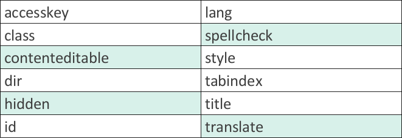
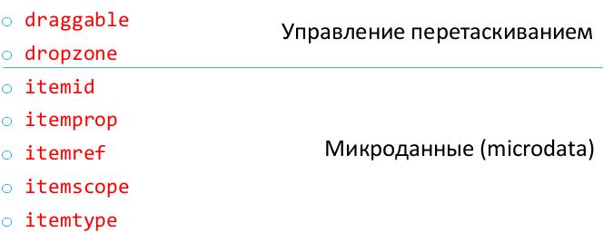
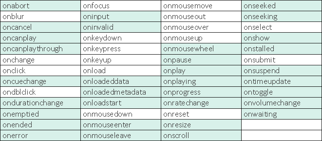

# 11. Глобальные атрибуты и атрибуты событий.

## Глобальный атрибуты

**Глобальные атрибуты** – атрибуты, которые могут применяться к любым HTML-элементам (но для некоторых элементов их применение не даёт эффекта).

По спецификации, браузер должен корректно работать с глобальными атрибутами, даже если они применяются к нестандартным элементам HTML. Например, браузер должен скрывать содержимое элемента `<foo>`, если записано `<foo hidden>`.

* `id="textString"` Присваивает элементу идентификатор (строка без пробелов, минимум один символ, регистрозависимый). Идентификатор элемента должен быть уникален в пределах документа.
* `style="CSS style"` Позволяет применить к элементу указанные правила CSS-стиля (inline CSS).
* `title="text string"` Связывает с элементом произвольную описательную строку. Некоторые элементы (поля ввода, картинки, кнопки и прочее) показывают эту строку при наведении на них курсора (tooltip).
* `accesskey="character"` Связывает с элементом клавишу быстрого доступа ([Alt]+character). Значением должен быть или единственный символ (цифра, латинская буква) или одиночные символы, записанные через пробел.
* `tabindex="number"` Связывает с элементом позицию табуляции (целое число). Будет реально работать только для элементов, которые могут получать фокус.
* `dir="ltr|rtl|auto"` Задает направление отображения текста: слева направо, справа налево или на основании символов текста (auto).
* `lang="code"` Устанавливает язык (при помощи языкового кода), на котором написан текст внутри элемента. Это влияет на отображение некоторых символов (например, кавычек). Значение атрибута регистрозависимо.
* `hidden` Логический атрибут. Обозначает, что соответствующий элемент не должен отображаться браузером.
* `contenteditable="true|false"` Сообщает, что элемент доступен для редактирования пользователем – можно удалять текст и вводить новый. Вместо true допустимо указывать пустое значение или использовать атрибут как логический.
* `spellcheck="true|false"` Указывает браузеру на необходимость проверки правописания для содержимого элемента. Реально работает для элементов input, textarea, и для тех элементов, у которых `contenteditable="true"`.
* `translate="yes|no"` Указывает, что текстовое содержимое элемента нуждается (или не нуждается) в переводе (у Google Chrome – Перевести страницу).
* `data-*="value"` Любые атрибуты, начинающиеся с `data-`, служат для внедрения в документ пользовательской информации. Работа с этой информацией происходит при помощи JavaScript. Имя атрибута не должно содержать символов в верхнем регистре.

## Атрибуты событий

События – это специальные глобальные атрибуты, используемые в тегах для вызова обработчиков событий, когда происходит какое-либо действие. Хотя события относятся к глобальным атрибутам, реально генерируемые события зависят от элемента.

