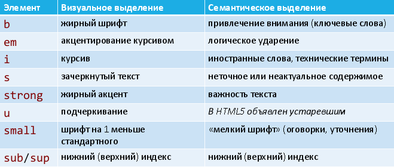

# 14. Семантическое и шрифтовое выделение текста.

Для выделения текста HTML5 предлагает следующие элементы: b, em, i, s, strong, u, small, sub, sup, code, var, samp, kbd, abbr, dfn, q, cite, time, mark.

Их свойства:

* являются контейнерными
* не являются блочными (не начинают новую строку)
* могут вкладываться друг в друга

До HTML5 выделение текста было визуальным. В HTML5 за указанными элементами закреплена семантическая функция выделения.



## Оформление листингов


Следующие элементы могут использоваться в HTML для оформления листингов программ:

* `code` фрагмент кода (моноширинный шрифт)
* `var` переменная (курсив)
* `samp` результат работы программы
* `kbd` ввод пользователя

## Сокращения

Элемент `abbr` позволяет вставить в документ сокращение (аббревиатуру). При этом его атрибут title должен расшифровывать сокращение.

```html
<abbr title="Florida Department of Citrus">FDOC</abbr>
```

Визуально сокращения или никак не выделяются, или выделены пунктирным подчёркиванием.

## Определения

Для вставки в HTML-документ определений служит элемент `dfn`. Определяемый термин задаётся как значение атрибута title, или как title у вложенного элемента `abbr`, или как содержимое dfn:

```html
The <dfn title="apple">apple</dfn> is the pomaceous fruit of the apple tree.
```

Браузеры, как правило, отображают содержимое dfn с помощью курсива.


## Цитаты и источники

Элемент `q` вставляет в документ цитату (в кавычках). Его атрибут `cite` позволяет указать источник цитаты. Для отдельного выделения (курсивом) источника цитаты может использоваться элемент cite:

```html
<q cite="http://en.wikipedia.org/wiki/Apple">The apple is the pomaceous fruit of the apple tree.</q>
```

```html
My favorite book on fruit is <cite>Fruit: Edible, Inedible, Incredible</cite>.
```

## Дата и время (HTML5)

При помощи элемента `time` текст помечается как дата и (или) время. Значение может указываться внутри контейнера time, либо через атрибут datetime.

```html
At <time datetime="15:00">3 o'clock</time> on <time datetime="1984-12-7">December 7th</time>.
```

## Выделенный текст (HTML5)

Элемент `mark` помечает текст как выделенный. В браузере текст внутри mark выделяется жёлтым фоном.

## Произвольный интервал текста

Элемент `span` работает как универсальный контейнер для выделение текста в строке. Основная идея – выделение фрагмента и дальнейшая настройка этого фрагмента при помощи CSS.

## Перевод строки

Элемент `br` устанавливает перевод строки в том месте, где находится. Является атомарным элементом.

## Потенциальный перевод строки

Элемент wbr указывает браузеру место, где допускается делать перенос строки в тексте, если этого требует ширина родительского элемента. Является атомарным элементом.

## Шрифтовое выделение

`<font>…</font>`

Это контейнер для изменения характеристик шрифта: размер, цвет, гарнитура. Считается устаревшим – лучше использовать CSS.

### Атрибуты

* `color` цвет текста
* `face` гарнитура шрифта (например: serif - шрифты с засечками; sans-serif - шрифты без засечек; cursive - курсивные шрифты; fantasy - декоративные шрифты; monospace - моноширинные шрифты)
* `size` размер шрифта в условных единицах (от 1 до 7)