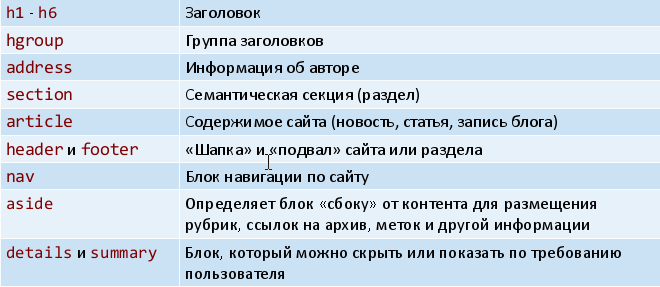

# 17. Семантические секции.

## Семантические секции до HTML5

Выделение логических секций в документе производится при помощи элементов `div` с заданными атрибутами `class` или `id`.

Элементы `h1-h6` определяют в документе семантические секции заголовков (разного уровня). А элемент `hgroup` позволяет заголовки группировать.

Элементы `address` предназначен для хранения информации об авторе. Может включать в себя любые элементы HTML вроде ссылок, текста, выделений и т. д.

Идея такая: поисковики анализируют содержимое этого элемента для сбора информации об авторах сайтов.

По умолчанию текст внутри контейнера `address` отображается курсивом.

## Семантические секции HTML5

Для отображения новых элементов не задано никаких правил, поэтому внешний вид можно стилизовать по своему усмотрению (все новые элементы – блочные).

Элемент `section` определяет общую семантическую секцию (возможно с заголовком).

Элемент `article` выделяет законченную статью (обычно с заголовком).

Элементы `header` и `footer` выделяют на странице (или в секции) так называемые «шапку» и «подвал». Ограничения на использование: не могут вкладываться в элемент address и друг в друга (в любых комбинациях).

Для обозначения на странице раздела навигации (обычно – набор ссылок, организованный как меню) служит элемент `nav`. Количество разделов навигации на странице не ограничено. Единственной ограничение – такие разделы не должны вкладываться в секцию address.

Элемент `aside` определяет блок сбоку от основного контента для размещения рубрик, ссылок на архив, меток и другой информации. Такой блок, как правило, называется «сайдбар» или «боковая панель». По поводу ограничений – всё как для `nav`.

Элемент `details` создаёт разворачиваемую секцию для получения детальной информации. Логический атрибут `open` указывает начальное состояние секции. Вложенный элемент `summary` задаёт заголовок секции.

