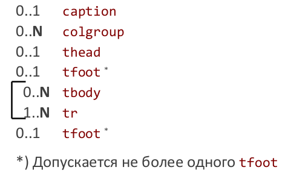

# 18. Таблицы.

Для построения и отображения таблиц в HTML используется элемент table и его дочерние элементы caption, colgroup, thead, tfoot, tbody, tr.

Все перечисленные элементы являются контейнерными. Заданы правила вложения элементов друг в друга.



В простейшем случае для построения таблицы используются следующие элементы:

* `table` обрамление всей таблицы
* `tr` строка таблицы, вложена в table
* `td` обычная ячейка, вложена в tr
* `th` «заголовочная» ячейка, вложена в tr

```html
<table>
<tr>
<th> Header 1 </th>
<th> Header 2 </th>
</tr>
<tr>
<td> Row 1, Cell 1 </td>
<td> Row 1, Cell 2 </td>
</tr>
<tr>
<td> Row 2, Cell 1 </td>
<td> Row 2, Cell 2 </td>
</tr>
</table>
```

## Атрибуты элемента `table`

* `align` выравнивание таблицы (`left|center|right`)
* `background` путь к фоновому рисунку
* `bgcolor` цвет фона таблицы
* `border` толщина рамки в пикселах
* `bordercolor` цвет рамки
* `cellpadding` расстояние между границей ячейки и ее содержимым (px или % от доступного пространства)
* `cellspacing` расстояние между ячейками в пикселях
* `cols` количество столбцов в таблице
* `frame` способ отображения границ всей таблицы (`void | border | above | below | hsides | vsides |rhs |lhs`)
* `rules` способ отображения границ вокруг ячеек. По умолчанию none (если border="0") или all (если border отлично от нуля)(`all | groups | cols * | none | rows`)
* `summary` краткое описание таблицы (не отображается)
* `width` ширина таблицы (px или %)

Все перечисленные атрибуты, кроме `border`, объявлены в стандарте HTML5 устаревшими. А атрибут `border` в HTML5 изменил семантику. Он может принимать значения только 0 или 1 (0 - таблица используется для разметки, 1 - таблица используется как таблица)

## Атрибуты элемента `tr`

* `align` выравнивание содержимого по горизонтали
* `bgcolor` цвет фона ячеек
* `bordercolor` цвет рамки
* `valign` выравнивание содержимого по вертикали

Все эти атрибуты объявлены в HTML5 устаревшими. Атрибут bordercolor поддерживается только в IE.

## Атрибуты элементов `td` и `th`

Кроме align, bgcolor, bordercolor, valign, доступны:

* `abbr` краткое описание содержимого ячейки
* `background` фоновый рисунок ячейки
* `colspan` объединяет горизонтальные ячейки
* `headers` позволяет связать ячейки с заголовком
* `height` высота ячейки (px или %)
* `nowrap` (логический) запрещает перенос строк в ячейке
* `rowspan` объединяет вертикальные ячейки
* `width` ширина ячейки (px или %)

Все указанные атрибуты у td и th, за исключением colspan, rowspan и headers в HTML5 объявлены устаревшими. Атрибут bordercolor поддерживается только в IE.

### Атрибуты colspan и rowspan

Эти атрибуты используются для объединения ячеек по горизонтали (`colspan`) и вертикали (`rowspan`). Значением атрибутов является целое неотрицательное число. Правильнее: «вытеснение» ячеек. Построение таблицы происходит по ячейкам слева направо и сверху вниз («клеточная доска»).

### Атрибут headers

Атрибут `headers` связывает ячейку `td` или `th` с заголовочной ячейкой `th`. Значением атрибута является идентификатор (`id`) ячейки `th` (вариант: несколько идентификаторов, записанных через пробел).

Зачем всё это? Для людей с ограниченными возможностями (чтение ячейки в таблице по заголовку).

## Группировка строк

Контейнеры `thead`, `tbody`, `tfoot` группируют один или несколько элементов `tr`. Это позволяет отдельно настраивать (в том числе, при помощи CSS) заголовок, «тело» и «подвал» таблицы, фиксировать их при прокрутке и печати.

## Настройка колонок таблицы

При помощи элементов `colgroup` и `col` можно задать стиль одной или нескольких колонок таблицы. Собственные атрибуты: `align`, `valign`, `width` (устарели в HTML5), `span` (количество колонок, к которым нужно применять параметры). В HTML5 `col` должны быть вложены в `colgroup` (это можно сделать, если у `colgroup` не задан `span`).

```html
<table border="1" rules="groups">
<colgroup span="2" width="100"></colgroup>
<colgroup>
<col width="50">
<col width="25">
</colgroup>
<tr>
...
</tr>
</table>
```

## Заголовок таблицы

Заголовок представляет собой текст, по умолчанию отображаемый перед таблицей и описывающий её содержание. Для создания заголовка к таблице используется контейнер `caption`. Он может размещаться только внутри `table`, причём сразу после открывающего тега. Элемент `caption` имеет атрибут `align` – выравнивание заголовка (устарел).