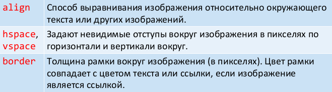
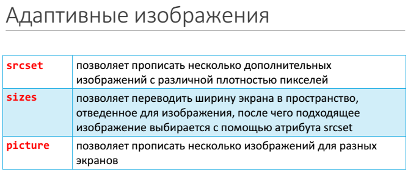

# 20. Изображения.

Элемент `img` предназначен для показа на веб-странице изображений (GIF, JPEG, BMP, SVG или PNG). Если необходимо, то рисунок можно сделать ссылкой, поместив `img` в контейнер `a`.

Рисунки также могут применяться в качестве карт-изображений, когда картинка содержит активные области, выступающие в качестве ссылок.

## Обязательные атрибуты

Адрес файла с картинкой задаётся через обязательный атрибут `src`.

Ещё один обязательный атрибут `alt` устанавливает альтернативный текст для изображений (отображается при отключенной в браузере загрузке изображений; если формат не поддерживается; если браузер текстовый; если страница читается вслух).

## Атрибуты

Атрибуты `height` и `width` устанавливают размеры изображения в пикселях или процентах (относительно родительского элемента). Ширину и высоту изображения можно менять как в меньшую, так и большую сторону. Добавление только одного атрибута сохраняет пропорции изображения.

Так как `alt` и `title` обычно не содержат большой текст, атрибут `longdesc` позволяет указать адрес документа с аннотаций к картинке (+ речевые браузеры).

Логический атрибут `ismap` сообщает, что картинка является серверной картой-изображением. Если изображение помещено в контейнер `a`, при нажатии на сервер будут передаваться координаты точки нажатия.

Следующие атрибуты относятся к устаревшим:

