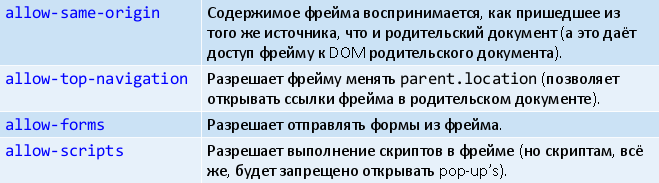

# 21. Фреймы.

**Фрейм** – объект в HTML-документе, который позволяет отобразить другой HTML-документ.

Исторически первые сценарии использования – навигация по сайту (нажатие навигационной ссылки ведёт к загрузке в фрейм указанного документа).

Контейнерный элемент `iframe` создаёт встроенный фрейм, который находится внутри обычного документа. Он позволяет загружать в область заданных размеров другие документы (работающие с определёнными ограничениями).

Внутри iframe можно указать текст, отображаемый, если браузер не поддерживает этот элемент. `<iframe name="fr" width="400" height="150">Old browser</iframe>`

В примере упомянуты атрибуты `name`, `width`, `height`. URL документа, изначально загружаемого в фрейм, задаёт атрибут `src`. А `srcdoc` может для этих же целей использовать HTML, записанный в своё значение (это новый атрибут в HTML5).

Атрибут `sandbox` (HTML5) строит «песочницу» вокруг фрейма, запрещая фрейму выполнять ряд действий. Если указать `sandbox` как логический:

* браузер считает, что фрейм и основной документ загружены из разных источников (а это значит, что фрейм и внешнее окно не могут обращаться к переменным друг друга в скриптах)
* отключает формы и скрипты во фрейме
* запрещает менять parent.location из фрейма

Атрибут `sandbox` может содержать через пробел список ограничений, которые нам не нужны. Например:

Для организации фреймов также может использоваться элемент `frame`, размещаемый в контейнере `frameset`. При этом на фреймы разбивается весь документ (`frameset` заменяет `body` в структуре документа!) Такой подход признан устаревшим.