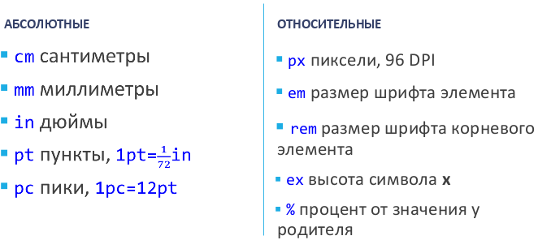

# 23. CSS – назначение и история. Терминология и синтаксис CSS.

## История

**CSS** (Cascading Style Sheets, каскадные таблицы стилей) – язык описания внешнего вида документа, созданного с использованием языка разметки. Языком разметки может быть XML, SVG, XUL, но обычно в этой роли выступает HTML.

Цель: разделить логическую структуру документа (например, HTML-документа) и описание внешнего вида.

+ разные виды одного документа (экран, принтер, голос)
* более «богатый» визуальный язык
* сам документ упрощается
* упрощается поддержка и разработка

Первое упоминание: **1994 год** - Хокон Виум Ли (Håkon Wium Lie). Далее – затишье, к разработке подключается Берт Бос (Bert Bos).

**1995 год** – интерес со стороны W3C.

После 1995 года: развитие CSS как языка и создание стандарта. Это нужно, чтобы разработчики браузеров включали поддержку возможностей CSS в свои продукты.

Версии стандарта CSS называют уровнями (Levels):

* Уровень 1 (CSS1): в конце 1996 года.
* Уровень 2 (CSS2): май 1998 года.
* Уровень 2, ревизия 1 (CSS2.1): июнь 2011 года.
* Уровень 3 (CSS3): официально не вышел, но многие браузеры поддерживают его возможности.

Несмотря на наличие стандартов, некоторые возможности CSS (1, 2, 3) не поддерживаются вообще или поддерживаются «по-особенному» в зависимости от браузера и его версии.

## Правила

**Таблица стилей** – набор правил CSS и комментариев. Таблица выглядит как текст заданного формата и может быть сохранена в файле (с расширением .css).

* Регистр не важен (обычно – нижний).
* В тексте пробельные символы (более одного) и переводы строк игнорируются.
* Комментарии ограничивают при помощи `/*` и `*/`.
* Каждое правило CSS (за исключением так называемых «at-rules») состоит из селектора и блока объявлений.
* Селектор описывает элементы документа, к которым применяются визуальные настройки.
* Селекторы могут группироваться через запятую (в таком случае блок объявлений применяется к каждому из них).
* Блок объявлений записывается в фигурных скобках и содержит одно или несколько объявлений.

Общий вид объявления следующий (есть нюансы): `свойство: значение;`

Пример правила CSS

```css
p {
color: red;
/* This is a single-line comment */
text-align: center;
}
```

Значением свойства может быть:

* Одно значение из фиксированного набора
* Число (целое десятичное число или десятичная дробь)
* Процентная запись (число + %)
* Размер
* Цвет
* Адрес (URL)
* Строка (в одинарных или двойных кавычках)
* Временной промежуток
* Величина угла

Для некоторых свойств допустимо задавать несколько значений через пробел.

Значение CSS-свойства может быть снабжено модификатором `important` в следующей форме: `свойство: значение !important;` Этот модификатор управляет приоритетом применения значения.

Единицы измерения **размера**:



Задание **цвета**:

1. Использовать имя: `aqua, black, blue, fuchsia, gray, green, lime, maroon, navy, olive, purple, red, silver, teal, white, yellow` (это базовые цвета, есть ещё).
2. Использовать hex-код: `#RRGGBB` или `#RGB` (=RRGGBB)
3. Использовать функции:

* `rgb(r,g,b)`
* `rgba(r,g,b,a)`
* `hsl(h,s,l)`
* `hsla(h,s,l,a)`

Аргументы функций: десятичные числа или проценты.

**Углы**:

* `deg` (градусы, 0-360)
* `rad` (радианы)
* `grad` (градианы, 1 град.=1/100 прямого угла)
* `turn` (повороты, 1 поворот = 360 градусов).

**Время**:

* `s` (секунды)
* `ms` (миллисекунды).

В CSS адреса применяются для указания пути к файлу (пример: установка фонового изображения). Чтобы задать адрес, используется функция `url()`. Внутри скобок пишется относительный или абсолютный адрес, который можно задавать в необязательных одинарных или двойных кавычках.