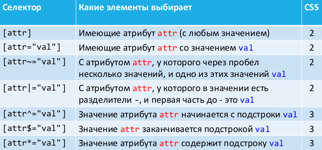
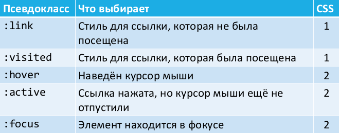
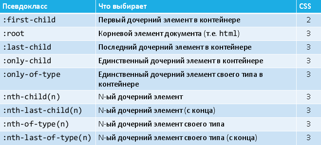
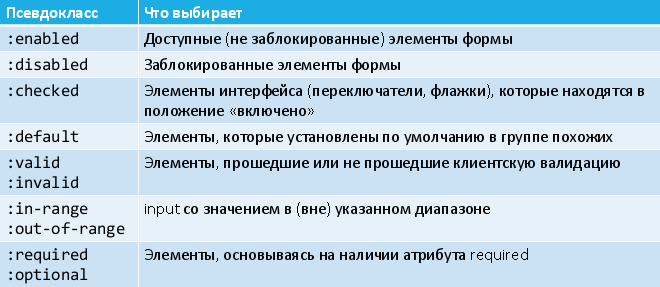
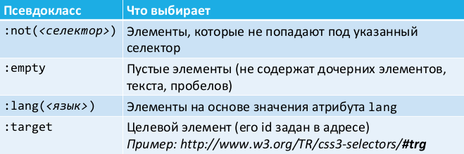
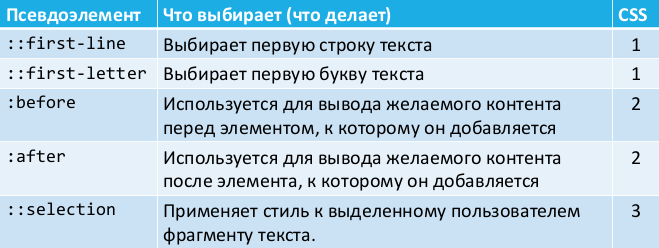

# 25. Селекторы CSS.

## Селекторы

Селекторы используются, чтобы найти (выбрать) HTML- элементы на веб-странице, основываясь на имени элемента, идентификаторе, классе, значениях атрибутов и других признаках.

**Универсальный селектор** выбирает все элементы на странице (включая body и html). Обозначается звёздочкой:

```css
* {
border-color: red;
border-width: 1px;
border-style: solid;
}
```

**Селектор элементов** выбирает все указанные HTML- элементы на странице. Используется имя элемента:

```css
/* выберет все элементы p (абзацы) */
p {
border-width: 1px;
border-style: solid;
}
```

**Селектор классов** выбирает HTML- элементы с указанным значением атрибута `class`:

```css
/* все элементы, у которых class="main" */
.main {
border-width: 1px;
border-style: solid;
}
```

**Селектор идентификаторов** выбирает HTML- элементы с заданным значением атрибута `id` (теоретически, один):

```css
/* элемент(ы), у которых id="pass" */
#pass {
color: red;
width: 200px;
}
```

**Селекция по атрибутам**



Селекторы могут быть скомбинированы путём простого объединения, без пробелов (работает как AND):

```css
/*элементы p, у которых class="main"*/
p.main { color: red; }
```

**Селектор потомков** `S1 S2` выбирает все элементы по селектору S2, которые вложены (на любом уровне) в элементы, выбранные по S1:

```css
/* любые p, находящиеся внутри любого div */
div p { color: red; }
```

**Селектор дочерних элементов** `S1 > S2` похож на S1 S2, но выбирает только прямых детей у S1:

```css
/* p, непосредственно вложенные в div */
div > p { color: red; }
```

Селектор `S1 + S2` выбирает элементы по S2, которые следуют в документе **непосредственно** за элементами, выбранными по S1.

Селектор `S1 ~ S2` выбирает элементы по S2, которые следуют в документе за элементами, выбранными по S1 (**необязательно непосредственно**).

Важно: речь идёт об элементах одного уровня

## Псевдоклассы

Псевдоклассы служат для описания:

* динамического состояния элемента, которое изменяется в ответ на действия пользователя (пример: ссылка меняет цвет при наведении курсора);
* положения элемента в дереве документа (пример: первый потомок).






```css
tr:nth-child(3n+2) { color: red; }
tr:nth-child(even) { color: red; }
```

## Псевдоэлементы

Псевдоэлементы позволяют задать стиль элементов, не определённых в дереве элементов документа. А ещё псевдоэлементы позволяют создать контент.



```html
<html>
<head>
<title>CSS</title>
<style type="text/css">
a:before { content: "Click here to "; }
a:after { content: "!"; }
</style>
</head>
<body>
<a href="http://apress.com">Visit the Apress website</a>
</body>
</html>
```