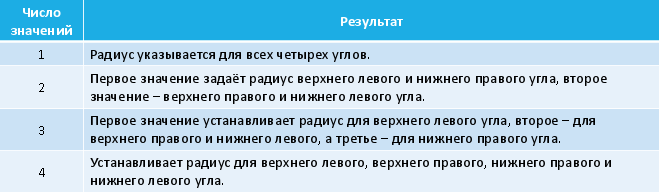
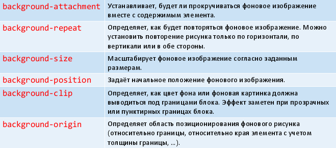

# 27. Блоки, их граница и фон.

Если у нас есть веб-страница, нужно представить, что вокруг каждого видимого HTML-элемента (и ещё html и body) существует прямоугольный блок, который мы можем настроить при помощи CSS. Блок имеет прямоугольную форму. Вокруг содержимого блока есть отступы. Фон отступов такой же, как и у содержимого. Содержимое и отступы обрамлены границей. Она может быть видимой или невидимой. Граница имеет толщину. Вокруг границы размещены прозрачные поля. Для содержимого блока определены ширина и высота. Поля и отступы при задании размера блока не учитываются.

При работе с полями следует учитывать такое явление, как «схлопывание полей» (margin collapsing). У двух соседних по вертикали блоков значения полей не складываются – используется большее! Из этого правила есть исключения: плавающие блоки, абсолютно-позиционированные блоки, inline-блоки.

Замечание: как правило, CSS-свойства, связанные с настройкой блоков, являются ненаследуемыми. Напоминание: многие ненаследуемые свойства могут принимать специальное значение inherit, которое заставляет брать значение свойства у родителя.

У границы можно настроить цвет (`color`), толщину линии (`width`) и тип линии (`style`).

Имена CSS-свойств конструируем так: дописываем через дефис указанные атрибуты либо к свойству border (все границы), либо к свойствам `border-top, border-right, border-bottom, border-left`. Например:

* `border-width` толщина всех границ
* `border-top-color` цвет верхней границы

Цвет задаётся как обычно в CSS.

Для толщины используем слова `thin` (2px), `medium` (4px), `thick` (6px), или любую единицу размера, исключая %.

Для `style` используем: `none, dotted, dashed, solid, double, groove, ridge, inset, outset`.

У границы или отдельной грани можно задать сразу три свойства: толщина тип цвет (порядок не важен (?)):

```css
border: 2px solid red;
```

Настраивая свойства `border-*`, можно задать одно значение (все грани), два значения (верх-низ и левый- правый), три значения (верх, левый-правый, низ), четыре значения (верх, правый, низ, левый):

CSS3 позволяет настроить закругления для углов границы блока.

Параметром закругления является либо одна единица размера (радиус закругления), либо две единицы (два радиуса эллипса закругления – X и Y).

Свойства для настройки закругления углов:

* `border-top-left-radius`
* `border-top-right-radius`
* `border-bottom-left-radius`
* `border-bottom-right-radius`

`border-radius` позволяет задать несколько закруглений сразу (через пробел). Если нужны вторые радиусы для эллипсов, то их перечисляем через слэш (/).



```css
p.three {
border-radius: 10px / 10px 30px 5px;
}
```

CSS3 позволяет строить границу, используя указанное изображения.

Реализуется при помощи свойств:

* `border-image-source`
* `border-image-slice`
* `border-image-width`
* `border-image-outset`
* `border-image-repeat`
* `border-image` (сокращённая форма задания)

Универсальное свойство `outline`, задаёт толщину, стиль и цвет на всех четырёх сторонах блока.

В отличие от линии, задаваемой через `border`, свойство `outline` не влияет на вычисленную ширину блока.

Есть отдельные свойства `outline-width`, `outline-style`, `outline-color` и ещё свойство `outline-offset`.

Цвет фона задаётся свойством `background-color`, а фоновая картинка – свойством `background-image`.

Для настройки отображения картинки служат свойства `background-repeat`, `background-size`, `background-position`, `background-clip`, `background-origin`.

Свойство background – сокращённая форма для задания параметров фона (`-attachment||-image||-position||-repeat||-color`).



Существует возможность указать и настроить несколько картинок для фона:

```css
p {
background: url(photo1.png), url(photo2.png), url(photo3.png);
background-repeat: no-repeat, no-repeat, repeat-y;
background-position: 0 0, 30px 70px, right top;
}
```