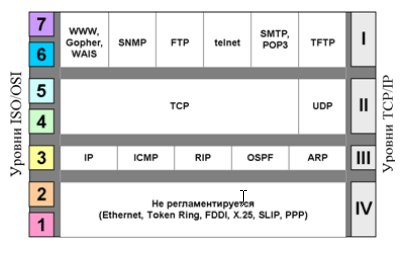

# 3. Стек протоколов TCP/IP.

**Стеком** протоколов называется стандартизованный разделенный на уровни набор протоколов, которые работают совместно, реализуя определенную коммуникационную архитектуру.

**Стек протоколов TCP/IP** – набор сетевых протоколов передачи данных, используемых в сетях, включая сеть Интернет.

Был разработан по инициативе Министерства обороны США (Department of Defence, DoD) в **1969 году** для связи экспериментальной сети ARPAnet с другими сетями как набор общих протоколов для разнородных вычислительных систем.

Реализует модель OSI (не точно, ибо появился раньше её). Реализован в большинстве операционных систем.

## Уровни стека TCP/IP

