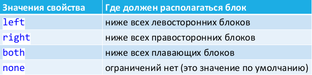

# 30. Позиционирование блоков.

По умолчанию блоки позиционируются (располагаются) на странице в нормальном потоке. Это последовательное размещение блоков **слева направо и сверху вниз**. Нормальный поток соответствует свойству блока `position` со значением `static` (это по умолчанию).

## position: absolute (абсолютное позиционирование)

При этой схеме расположение блока задается прямым указанием. Для этого существуют четыре свойства:

* `left` и `right` на сколько надо сместить блок относительно левого (правого) края родителя или окна
* `top` и `bottom` на сколько надо сместить блок относительно верхнего (нижнего) края родителя или окна

От чего считаем при абсолютном позиционировании:

* если у родителя значение `position:static` или родителя нет, то отсчет координат ведется от края окна браузера;
* если у родителя значение `position` задано как `fixed`, `relative` или `absolute`, то отсчет координат ведется от края родительского элемента.

## position: fixed (фиксированное позиционирование)

По своему действию близко к `absolute`, но привязка идёт всегда к окну браузера (а не к родительскому элементу). И, как следствие, положение элемента не меняется при прокрутке страницы!

## position:relative (относительное позиционирование)

Положение элемента устанавливается относительно его исходного места в нормальном потоке. Добавление свойств left, top, right и bottom изменяет позицию элемента и сдвигает его в ту или иную сторону от первоначального расположения.

## z-index

Блоки могут накладываться друг на друга (`position:absolute|fixed|relative`).

Свойство `z-index` указывает «высоту» блока от плоскости экрана. В качестве значения используются целые числа. При равных `z-index` на переднем плане находится тот элемент, который в коде HTML описан ниже.

## Плавающие блоки

Плавающий блок «прилепляется» к указанной стороне своего родителя, а остальные элементы его обтекают с других сторон.

Чтобы сделать блок плавающим, используется свойство `float` (возможные значения: `left`, `right`, `none`).

Плавающим может быть любой блок, кроме абсолютно позиционированных (`position: absolute|fixed`).

Особенности элемента, у которого float установлено в значение left или right:

* отображается как блочный (словно ему установили свойство `display: block`);
* по ширине сжимается до размеров содержимого (если у него явно не установлена ширина `width`);
* всё остальное содержимое страницы, идущее в HTML после элемента с `float`, обтекает его;

### clear

Свойство clear определяет, какие стороны плавающего блока не могут соседствовать с другими плавающими блоками.

