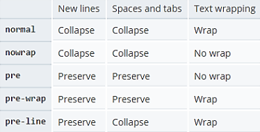
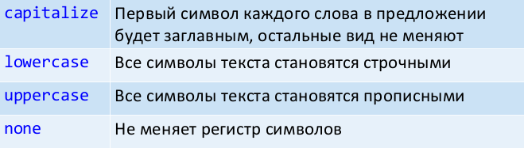
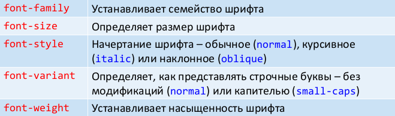

# 31. Форматирование текста в CSS.

Замечание: как правило, CSS-свойства, связанные с работой с текстом, являются наследуемыми.

Выравниванием текста внутри блока управляет свойство `text-align` (left, right, center, justify).

Свойство `white-space` устанавливает, как отображать пробелы между словами и переводы строк:



По умолчанию длинные слова выходят за пределы блоков, если только внутри слова не используется элемент `wbr`. Если у свойства `word-wrap` установить значение `break-word`, то слово разрывается, чтобы уместиться в блок (по умолчанию значение `normal`). Свойство `word-break` выполняет перенос «жёстче» (возможные значения: normal, break-all, keep-all):

Свойство `text-overflow` управляет видом обрезанного текста в блоке. Если `text-overflow:ellipsis`, то к концу обрезанного текста будет добавляться многоточие (обычное поведение соответствует значению `clip`). Свойство работает для блоков, у которых свойство `overflow` установлено в `auto` или `scroll` или `hidden`.

Для настройки расстояний в тексте служат свойства `letter-spacing`, `word-spacing` и `line-height`. Значением всех свойств может быть размер или `normal`(задает интервал как обычный). У `line-height`, кроме размера и `normal`, значением могут быть проценты или число (множитель от размера шрифта текущего текста).

Размер красной строки задаётся свойством `text-indent`. Значением является размер или проценты (от общей ширины блока).

Свойство `text-transform` управляет преобразованием текста в заглавные или прописные символы:



Свойство `color` задаёт цвет переднего плана (foreground color). Однако `color` определяет и цвет границы для блока или изображения (если не установлено border-color), и цвет (некоторых) элементов управления.

Свойство `text-decoration` даёт тексту эффекты подчёркивания или мигания. Значения свойства: underline, overline, line-through, blink и none. Все значения, кроме none, можно комбинировать (через пробел). Планируется закрепить в стандарте свойства для настройки линии: `text-decoration-color, text-decoration-line, text-decoration-style`.

Добавить тень к тексту и установить её параметры можно при помощи свойства `text-shadow`. Параметры тени задаются через пробел:

* сдвиг тени по горизонтали относительно текста
* сдвиг тени по вертикали относительно текста
* радиус размытия тени (необязательный параметр)
* цвет тени (необязательный параметр)

Следующие свойства управляют параметрами шрифта:



## font-family

В качестве значения свойства `font-family` обычно используют список названий, разделённых запятой. `font-family: Georgia, 'Times New Roman', serif;`

Когда браузер встречает первый шрифт в списке, он проверяет его наличие на компьютере. Если шрифта нет, берётся следующее имя из списка. Обычно список заканчивают ключевым словом для типа шрифта – serif, sans-serif, cursive, fantasy, monospace.

## font-size

Размер может быть установлен несколькими способами:

* `xx-small, x-small, small, medium, large, x-large, xx-large` задают абсолютные размеры шрифта.
* `larger, smaller` устанавливает размеры шрифта относительно шрифта родительского элемента.

Можно использовать единицы размера и проценты.

## font-weight

Значение устанавливается от 100 до 900 с шагом 100.

Можно использовать ключевые слова `bold` (полужирное начертание, 700), `normal` (нормальное начертание, 400).

Значения `bolder` и `lighter` изменяют жирность относительно насыщенности родителя, соответственно, в большую и меньшую сторону.

## font

Универсальное свойство font позволяет одновременно задать несколько характеристик шрифта.

```
font: [font-style||font-variant||font-weight]
font-size [/line-height] font-family
```

В качестве обязательных значений указывается размер шрифта и его семейство.

## @font-face

`@font-face { свойства шрифта }`

Свойства шрифта – это обычные `font-family`, `font-size`, `font-style` и др., а также ссылка на шрифтовой файл в виде `src: url(URI)`.

Внимание: значение font-family будет использоваться для ссылки на шрифт в таблице стилей!