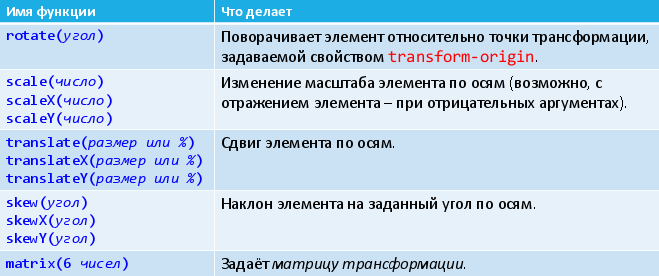

# 34. Трансформация.

**Трансформация** – это изменение вида элемента следующими модификациями: поворот, наклон, сдвиг, масштабирование.

Чтобы сделать трансформацию, к селектору добавляется свойство `transform`, а в качестве значения пишется функция трансформации и её параметры: `transform: функция(параметры);`

Трансформация будет работать не для всех элементов (это согласуется со спецификацией CSS3)!

[http://www.w3.org/TR/css-transforms-1/#transformable-element](http://www.w3.org/TR/css-transforms-1/#transformable-element)

Если коротко – для блочных работает, для строчных нет.


Функции трансформации



```css
#banana {
background-color: green;
color: white;
padding: 4px;
display: inline-block;
transform: rotate(-45deg) scale(1.5);
}
```

Любая трансформация может быть описана матрицей (если используются однородные координаты). Если удобно так задать трансформацию, то используем функцию `matrix(a, b, c, d, tx, ty)`.

Любая трансформация происходит относительно определённой точки. Исходно эта точка находится в центре элемента. Но это можно изменить с помощью свойства `transfom-origin`.

Значением свойства являются или координаты точки трансформации по осям X и Y, или ключевые слова `[left|center|right] || [top|center|bottom]`

```css
transform: rotate(-45deg) scale(-1);
transform-origin: left top;
```