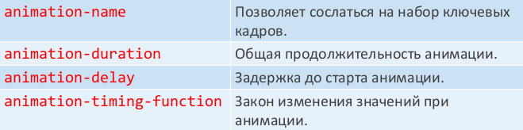
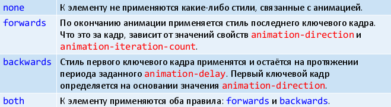

# 36. Анимация.

В CSS для построения анимации используются последовательности ключевых кадров. **Ключевой кадр (КК)** – это набор свойства и их значений, снабжённый относительной временной отметкой (%).

**Анимация** – плавный переход от одного ключевого кадра к другому с автоматическим вычислением значений промежуточных кадров.

**Один КК** – это совокупность относительной временной отметки (в процентах) и блока объявления свойств.

Первый КК из последовательности имеет (обычно) отметку 0%, а последний – отметку 100%.

Вместо отметок 0% и 100% можно использовать слова from и to соответственно.

Нюанс 1: Первый КК может иметь отметку больше 0% . В этом случае анимация начнётся с задержкой. Аналогичные соображения о последнем кадре!

Нюанс 2: Не все CSS-свойства поддаются анимации. Список можно найти здесь:


Для создания набора ключевых кадров используется правило @keyframes.


Указывается имя набора (уникальное) и кадры.


Набор ключевых кадров – пример

```css
@keyframes grow {
    from {
        width: 150px;
        background-color: red;
    }
    50% {
        width: 200px;
    }
    to {
        width: 300px;
        background-color: blue;
    }
}
```


Чтобы применить анимацию к выбранным селектором элементам, используются свойства вида `animation-*`:



```css
#box {
width: 100px;
height: 100px;
background-color: teal;
animation-name: grow;
animation-duration: 3s;
animation-delay: 1s;
animation-timing-function: linear;
}
```

По умолчанию:

1. Анимация запустилась автоматически (после загрузки страницы) и отработала ровно один раз.
2. Свойства, изменяемые анимацией, не зафиксировались в элементе (иными словами – элемент какой был до анимации, такой и остался после неё).

Свойство `animation-iteration-count` определяет, сколько раз проигрывать цикл анимации. Значением является положительное число или `infinite`.

Свойство `animation-direction` задаёт направление выполнения анимации по набору ключевых кадров:

* `normal` начало – конец
* `alternate` начало – конец, потом конец – начало
* `reverse` конец – начало
* `alternate-reverse` конец – начало, начало – конец



Свойство `animation-play-state` определяет, проигрывать анимацию (`running`) или поставить её на паузу (`paused`). Часто используется с псевдоклассами (`:hover`) или через клиентские скрипты.

Настройку анимации можно выполнить при помощи универсального свойства `animation`.

```
animation: animation-name||animation-duration||
animation-timing-function||animation-delay||
animation-iteration-count||animation-direction||
animation-fill-mode||animation-play-state
```

Анимации vs переходы

* Описать переход проще
* Переходы шире поддерживаются браузерами (пока)
* Переход всегда срабатывает как ответная реакция на изменение CSS-свойства
* Анимацию можно зациклить, переход – нет
* У перехода отсутствуют промежуточные ключевые кадры