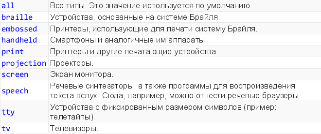
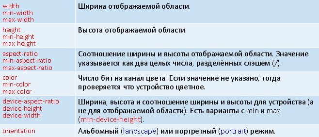

# 37. Медиа-запросы.

**Медиа-запросы (media queries)** – средство CSS, позволяющее применять разные стили в зависимости от типа или технических характеристик устройства отображения.

Медиа-запрос в CSS-файле – это правило `@media`, за которым следует одно или несколько выражений, описывающих параметры устройства. Затем в фигурных скобках записывается набор правил CSS. Правила применяются, если запрос верен, т.е. выражение (или все выражения) выполняются для данного устройства.


Медиа-запросы – пример

```css
#box {
width: 100px;
height: 100px;
background-color: teal;
}
@media (max-width: 300px) {
    #box {
        background-color: red;
    }
}
```

Типы носителей и их описание



```css
@media screen {
    #box {
        color: white;
    }
}
```

**Медиа-функции** описывают технические характеристики устройства отображения (пример: разрешение экрана).

Многие функции содержат приставку min- и max-:

`(max-width:400px)` верно, если ширина окна браузера меньше, чем 400 пикселей

Некоторые медиа-функции



При описании медиа-запроса вызовы медиа-функций и типы носителей можно комбинировать, используя логические операторы:

* `and` «И»
* `,` (запятая) «ИЛИ», перечисляются запросы
* `not` «НЕТ»

При применении операторов можно указывать скобки.

```css
/* устройство - экран и он цветной */
@media screen and (color) { ... }
```

Медиа-запрос можно указать в атрибуте media у элемента link (разные CSS-файлы):

```html
<link rel="stylesheet" href="small.css"
media="screen and (max-width: 600px)" />
```

А ещё атрибут `media` есть у элементов `style`, `source` (аудио, видео, picture), элементов `a` (с `href`) и `aria`.