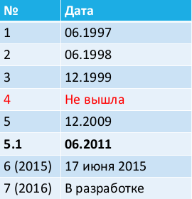

# 38. История JavaScript. Лексическая структура скрипта JavaScript, строгий режим.

**JavaScript** – прототипно-ориентированный сценарный язык программирования.

* **1995** – Брендан Айк (Brendan Eich) в Netscape создаёт встроенный скриптовый языка для браузера Netscape Navigator. Вдохновение: функциональные языки, ООП, синтаксис C, автоматическое управление памятью.
* **09.1995** – LiveScript (NN 2.0 beta)
* **12.1995** – JavaScript (NN 2.0B3). В мае 1995 появился язык Java, и это было модное слово!
* **07.1996** – JScript (Internet Explorer 3.0). JScript – это порт JavaScript, созданный корпорацией добра!
* В конце **1996 года** Netscape обратилась в Ecma International с просьбой утвердить стандарт JavaScript.
* **06.1997** – спецификация ECMA-262 (первая редакция). Язык, описанный в ECMA-262, называют ECMAScript.

Дальше дело было так:


1. Периодически выходили новые редакции ECMA-262 (новые версии ECMAScript).
2. Компании выпускали новые версии браузеров – так появлялись новые версии JavaScript, JScript,...


Конечно, эти версии опирались на стандарт! Но всё-таки немного отличались от него. Их принято называть диалектами ECMAScript.

Редакции ECMA-262



**Движок JavaScript** (JavaScript engine) – виртуальная машина, транслирующая и выполняющая JavaScript-код (как правило, в браузере).

Популярные движки: V8, SpiderMonkey, Chakra, Nitro, JavaScriptCore, JScript.

С точки зрения синтаксиса языка и API – у каждого движка свои (мелкие) особенности. Интерпретация или компиляция – зависит от движка (чаще всего используется гибридный подход).

Подключение JavaScript (1)

```html
<!DOCTYPE html>
<html>
<head></head>
<body>
<h1>Hello</h1>
<script>
var x = 10;
alert(x);
</script>
</body>
</html>
```

Подключение JavaScript (2)


index.html

```html
<!DOCTYPE html>
<html>
<head></head>
<body>
<h1>Hello</h1>
<script src="scripts/example.js"></script>
</body>
</html>
```

scripts\example.js

```javascript
var x = 10;
alert(x);
```

**Лексическая структура языка программирования** – набора элементарных правил, определяющих как пишутся программы на этом языке.

* Для записи скриптов используются символы Unicode
* Чувствительность к регистру
* Исходный код – набор инструкций и комментариев
* Комментарии бывают строчные и блочные
* Пробелы и пробельные символы игнорируются
* Комментарии игнорируются

Для отделения инструкций используется точка с запятой.

JavaScript трактует переход на новую строку как точку с
запятой:

* сразу после ключевых слов return, break, continue
* перед операторами ++ и --
* если следующий непробельный символ не может быть интерпретирован как продолжение текущей инструкции

В ECMAScript 5 появился «строгий режим» (strict mode).

Программирование в строгом режиме накладывает ряд ограничений, чтобы оградить программиста от опасных частей языка (те части, которые есть исторически, но лучше чтобы их не было) и снизить вероятность ошибки.

Включение строгого режима

```
"use strict";
(или 'use strict';)
```

* В первой строке скрипта – действует на весь скрипт.
* В первой строке функции – действует внутри функции.
* Не в первой строке – ни на что не влияет.