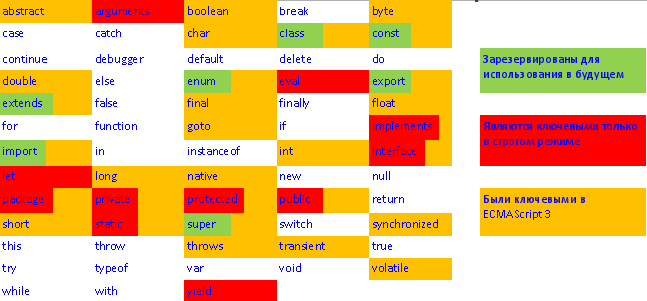

# 39. Идентификаторы и ключевые слова.

Идентификаторы в JavaScript cостоят из:

* букв,
* цифр,
* символов _ (подчеркивание) и $ (доллар)

Первый символ не должен быть цифрой.

**Ключевое слово** – идентификатор, зарезервированный для нужд языка

То есть, мы не можем использовать ключевое слово как имя для своих нужд

Список ключевых слов распадается на следующие категории:

* Зафиксированы в текущем стандарте
* Зарезервированы для использования в будущем
* Были ключевыми в предыдущих версиях стандарта
* Являются ключевыми только в строгом режиме

**Настоящие ключевые слова** – только в первой категории, но остальное лучше не использовать.

