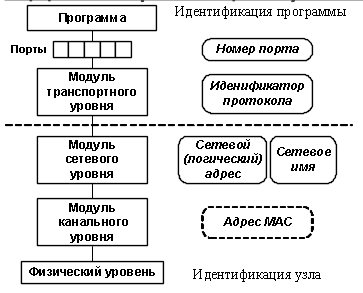

# 4. Коммуникация в TCP/IP.

Сетевое взаимодействие подразумевает минимум *двух участников*: отправителя информации по сети и получателя этой информации (например, браузер и веб-сервер; почтовый клиент и почтовый сервер).

Протоколы транспортной системы обычно реализованы на уровне OC. Их функции доступны через соответствующее API.

Идентификатор участника сетевого взаимодействия состоит из *двух частей*:

1. Идентификатора (адреса) узла.
2. Идентификатора программы на этом узле.

Протокол сетевого уровня (например, IP) использует логические адреса (сетевые адреса).

На уровне оборудования используются физические адреса (MAC-адреса). Преобразование физических адресов в логические и обратно называют **разрешением адресов**. Оно прозрачно для прикладных программ.

Для удобства человека и повышения гибкости системы узлы могут получать символические обозначения – **сетевые имена**. Преобразование сетевых имен в адреса выполняется обычно специальными службами (DNS, NAT).

В качестве идентификатора программы принято использовать номер порта, который предоставлен программе.

Транспортные протоколы создают порты независимо друг от друга, поэтому необходим также и идентификатор транспортного протокола. Полный идентификатор включает три звена:

\<сетевой адрес\>:\<транспортный протокол\>:\<порт\>

Например: 192.168.0.99:TCP:8080

Передача информации по протоколу TCP/IP состоит из *четырех этапов*:

1. протокол ТСР: разбиение информации на нумерованные пакеты;
2. протокол IP: передача пакетов получателю;
3. протокол TCP на стороне получателя: проверка комплектности полученных пакетов;
4. протокол TCP: восстановление искомой информации.
