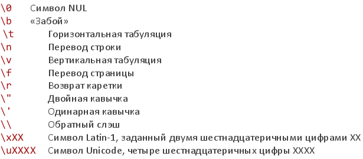

# 41. Литералы.

**Литерал** – последовательность символов в исходном коде скрипта, которая представляет фиксированное значение некоторого типа данных.

Иными словами, литерал – это константа, непосредственно включённая в текст программы.

## Десятичные числовые литералы

Целые десятичные – используем цифры. Впереди можно поставить знак + или –

Лучше не начинать десятичное число с незначащего нуля (скоро станет понятно, почему):

## Шестнадцатеричные литералы

Целые шестнадцатеричные – начинаем с `0x` или `0X` и используем цифры `0,1,…,9,a,b,c,d,e,f,A,B,C,D,E,F`. Впереди можно поставить знак + или –

## Восьмеричные числовые литералы

Целые восьмеричные – начинаем с 0 и используем цифры `0,1,…,7`. Впереди можно поставить знак + или –

Три настораживающих факта о восьмеричных числах:

- если в числе встретиться 8 или 9 – уже как десятичное
- не допустимы в строгом режиме
- в стандарте указаны как возможное расширение

## Числовые литералы

Максимальное целое число, хранимое точно = 2^53:

## Литералы вещественных чисел

Синтаксическая форма литерала вещественных чисел (используются десятичные цифры):

`[цифры][.цифры][(E|e)[(+|-)]цифры]`


Впереди можно указать знак + или – (но только если следом за ним не точка)

## Строковые литералы

Последовательность Unicode-символов в парных одинарных или двойных кавычках:



Если после обратного слэша записан «неожиданный» символ, то обратный слэш игнорируется

## boolean

true false

## null

Один возможный литерал для типа null

## Литералы регулярных выражений

Текст между парой символов слэша – литерал регулярного выражения. За вторым слэшем может следовать один или более символов, которые модифицируют поведение шаблона:

```javascript
var x = /[1-9][0-9]*/;
var y = /\bjava\b/i; // флаг i - учитывать регистр
```

Отдельного типа для регулярных выражений нет! При применении литерала создаётся объект, используя конструктор RegExp():

```javascript
// полная форма
var expr = new RegExp("pattern", "flags");
// сокращенная форма
var expr = /pattern/flags;
```

## Литералы массивов и объектов

Если честно, «литералы массивов» и «литералы объектов» – это не литералы (согласно строгой грамматики JavaScript)! Ибо могут содержать внутри выражения. Правильное их название: выражения-инициализаторы.

### Литералы массивов

Квадратные скобки, в них через запятую перечислены ноль или более элементов массива (литералы или выражения):

Элементы массива можно «пропускать»:

```javascript
var d = [1,,,4,5];
```

### Литералы объектов

Фигурные скобки, в них через запятую перечислены ноль или более пар `имя : значение`, определяющих свойства объекта. В качестве значения – литерал или выражение (в частности, выражение функции):

```javascript
var person = {
name: "Alexey",
age: 100 + 100
};
```

Именем свойства может быть идентификатор или строковый литерал (когда идентификатор не допустим):

```javascript
var person = {
"person name": "Alexey",
'var': 100
};
```