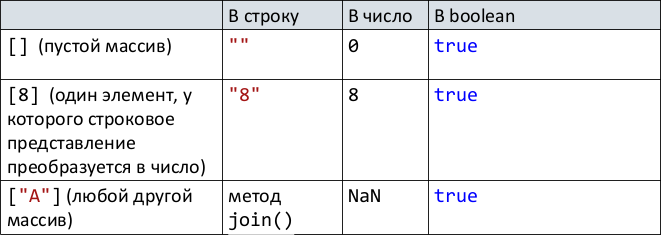

# 42. Преобразование типов.

## Преобразование объектов в строку

A. Есть `toString()`, который возвращает не объект => преобразовать результат в строку.

Иначе

B. Есть `valueOf()`, который возвращает не объект => преобразовать результат в строку.

Иначе

С. Ошибка `TypeError`.

## Преобразование объектов в число

A. Есть `valueOf()`, который возвращает не объект => преобразовать результат в число.

Иначе

B. Есть `toString()`, который возвращает не объект => преобразовать результат в число.

Иначе

С. Ошибка `TypeError`.

## Преобразование объектов в boolean

Всегда возвращает true.

## Неявные и явные преобразования

До этого описывались неявные преобразования.

Явное преобразование – инициировано программистом.

Выполняется при помощи специальных методов конвертации или вызовов конструкторов объектов- обёрток.