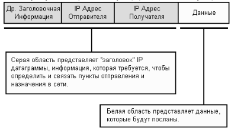

# 5. Протокол IP.

Принадлежит стеку TCP/IP (сетевой уровень).

Решает две задачи:

1. адресация узлов сети;
2. передача данных между адресованными узлами.

Система адресации позволила объединять сети. Сеть Internet построена на протоколе IP. Протокол появился в **1981 году**. Информация передаётся порциями (датаграмма, пакет). Длина макс. 65535 байт, но обычно короче.

**IP-сеть** – сеть, использующая протокол IP для работы. Каждому узлу IP-сети назначается *сетевой адрес* (IP-адрес, «айпишник»). В протоколе IP версии 4 (IPv4) адреса 32-разрядные. Принятая форма записи адреса: байты как десятичные числа, разделённые точками, старший байт в начале(192.168.0.99)

Адреса сетевого уровня обычно иерархические. То есть, одна часть сетевого адреса может указывать номер сети, вторая часть − номер узла в этой сети. Адреса сетевого уровня различаются в зависимости от используемого семейства протоколов.

## Специальные адреса

* **0.0.0.0** – узел-источник пакета данных или узел с неопределенным адресом (например, для задач маршрутизации).
* **255.255.255.255** – «все узлы», т. е. любой узел сети. Это позволяет организовать широковещательную (broadcast) рассылку (правда только в пределах локальной сети – не можем засорять Internet!).
* **127.x.x.x** (семейство адресов) – локальный адрес; это тот узел, на котором выполняется программа. Обычно используется 127.0.0.1, сетевое имя: localhost
* **10.x.x.x, 172.16.x.x - 172.31.x.x, 192.168.x.x** – «внутренние» адреса: пакеты данных, направленные на эти адреса, действуют только в локальной сети, никогда не отсылаются из неё в глобальную и соответственно никогда из нее не приходят. Уникальность таких адресов необходимо поддерживать только в пределах локальной сети, но при этом, очевидно, узел не может иметь прямого выхода в глобальную сеть.