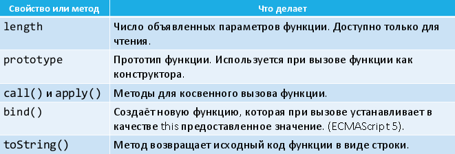

# 52. Функции как объекты.

Функции в JavaScript являются полноценными объектами. Заметим, что оператор `typeof` возвращает для функций не "`object`", а "`function`".



Вызов `bind()` возвращает новую функцию, у которой контекст вызова `this` жёстко установлен в указанное значение:

```javascript
function f(y) { return this.x + y; }
var obj = { x : 10 };
var g = f.bind(obj); // вызов g(x) вызовет obj.f(x)
var result = g(2); // result = 12
```
При вызове bind() можно закрепить не только this, но и значения некоторых аргументов функции:

```javascript
function f(y) { return this.x + y; }
var obj = { x : 10 };
var g = f.bind(obj, 2);
// теперь вызов g() всегда означает obj.f(2)
var result = g(); // result = 12
```

```javascript
function sum(x, y, z) {
return x + y + z;
}

// контекст не используется, поэтому null
// фиксируем: x = 1, y = 2
// (это называется каррирование или карринг)
var sumOneTwo = sum.bind(null, 1, 2);
var result = sumOneTwo(10); // result = 13
```

Так как функции – это объекты, их можно хранить и обрабатывать как объекты:

В JavaScript к объекту можно в любой момент присоединить и инициализировать новое свойство.

Можно передавать одни функции в качестве аргументов другим функциям.

Вполне возможно, что объект-функция возвращается другой функцией.