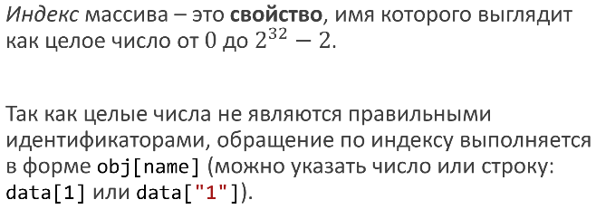

# 56. Доступ к элементам и индексы.


Любой массив – это объект.

Любой объект – это коллекция свойств и значений.

Любое свойство имеет имя.

Универсальное обращение к свойству: obj[name], где name автоматически приводится к string (а если имя свойства – это правильный идентификатор, то можно так: obj.name).



Примеры показывают состав индексов массива:

```javascript
var a = [];
// индексов нет
a[0] = 10;
// один индекс: 0
var x = a[1];
// один индекс: 0
var b = [1, ,3];
// два индекса: 0 и 2
delete b[0];
// один индекс: 2
b[2] = undefined;
// один индекс: 2
var c = new Array();
// индексов нет
var d = new Array(2);
// индексов нет!
var e = new Array(1, "Alex");
// два индекса: 0 и 1
```

## length

Любой массив имеет свойство `length`.

Интуитивно: это «длина» массива, т.е. количество элементов в нём. Но это справедливо только для плотных массивов – у разреженных свои нюансы!

Всегда верно: length будет больше максимального индекса массива (и почти всегда – ровно на 1).

```javascript
var a = [];
// length = 0
a[0] = 10;
// length = 1
a[10] = 100;
// length = 11
delete a[10];
// length = 11
var b = [1, ,3];
// length = 3
b[2] = undefined;
// length = 3
var c = new Array(2);
// length = 2
c[0] = 10;
// length = 2
```

Свойство length можно записывать. Уменьшение length приводит к «усечению» массива – исчезают элементы и индексы:

```javascript
var a = [1, 2, 3];
a.length = 2;
// у массива a индексы 0 и 1
```

При увеличении length не появляется ни новых элементов, ни новых индексов:

```javascript
var b = [1, 2];
b.length = 3;
// у массива b индексы 0 и 1
```

Обычно обход выполняется при помощи for:

```javascript
for(var i = 0; i < a.length; i++)
alert(a[i]);
//(Микро)оптимизация:
for(var i = 0, len = a.length; i < len; i++)
alert(a[i]);
//Пропускаем несуществующие и undefined-элементы:
for(var i = 0; i < a.length; i++) {
if (a[i] === undefined) continue;
// тело цикла
}
//Пропускаем только несуществующие элементы:
for(var i = 0; i < a.length; i++) {
if (!(i in a)) continue;
// тело цикла
}
```

Для обхода «сильно» разреженного массива можно применить цикл for/in:

```javascript
for(var index in sparseArray) {
var value = sparseArray[index];
// далее операции с индексами и значениями
}
```

Желательно задуматься о проверках, чтобы делать перебор только собственных свойств, которые одновременно являются индексами.