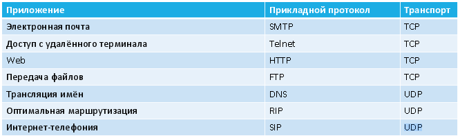

# 6. Протоколы UDP и TCP.

**UDP** – User Datagram Protocol (протокол пользовательских датаграмм)

**TCP** – Transmission Control Protocol (протокол управления передачей)

Оба протокола – из стека TCP/IP (транспортный уровень). Решают задачи доставки сообщений.

## UDP

Простой транспортный протокол.

По сути, берёт порцию данных, снабжает её коротким служебным заголовком и передаёт всё это протоколу IP для дальнейшей передачи. Факт получения или пропажи данных никак не отслеживается.

|Плюсы|Минусы|
|-|-|
|Быстрее передаёт данные, так как не выполняет процедуры установления соединения между узлами|Не гарантирует доставки данных|
|Позволяет вести широковещательную рассылку (в рамках локальной сети)|Сообщения имеют ограниченную длину (65 528 байт). Значит, много данных нужно передавать несколькими сообщениями|
|Имеет короткий служебный заголовок (8 байт)||
{:.mbtablestyle}

## TCP

Основная задача – надёжная доставка данных.

Ориентирован на соединение: два приложения перед обменом данными должны выполнить определенные вспомогательные действия, называемые **установлением соединения**.

Следствие: в обмене данными всегда участвуют две оконечные точки. Организовать широковещательную рассылку при помощи протокола TCP нельзя!

Для обеспечения надёжности:

1. Разбивает передаваемые данные на сегменты оптимальнойдлины, которые приёмник собирается в правильном порядке.
2. При пересылке сегмента использует таймер для ожидания подтверждения от принимающей стороны (квитанция). Если по истечении определенного времени квитанция не приходит, выполняется повторная передача сегмента.
3. После получения сегмента данных принимающая сторона проверяет контрольную сумму сегмента.

|Плюсы|Минусы|
|-|-|
|Обеспечивает надёжную доставку информации|Работает медленнее UDP|
||Нет широковещательной рассылки|
||Медленнее «стартует» (установление соединения)|
{:.mbtablestyle}

## Использование UDP и TCP

