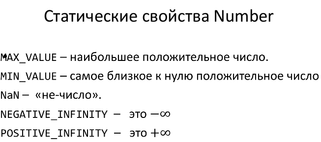
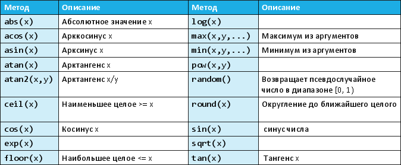

# 60. Числа.

Для значений number, boolean, string существуют объекты-обёртки. Они нужны, когда работа со значением происходит как с объектом (например, если у значения вызывается метод).

Для получения обёрток используются функции `Number(), Boolean(), String()`, вызываемые как конструкторы.

Прямой вызов этих конструкторов не приветствуется – нужно полагаться на автоматическое приведение типов.

## Number

Чтобы получить объектную обёртку над типом number, необходимо вызвать функцию `Number()` как конструктор. Вызов `Number()` как функции можно использовать для конвертации произвольного значения в число:

Методы объекта `Number` служат для получения строкового представления числа:

* `toExponential()` – в экспоненциальной форме
* `toString()` – в обычном виде (можно указать систему счисления)
* `toPrecision()` – с указанным общим количеством цифр
* `toFixed()` – с заданным количеством цифр после точки

##  Math

`Math` является встроенным объектом, хранящим в свойствах различные математические константы, а в методах – математические функции. Несмотря на название, Math не является функцией- конструктором.

Свойства `Math` представляют различные математические константы. И изменить их нельзя!

