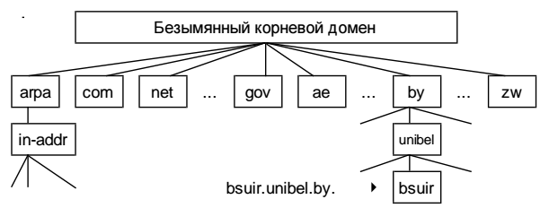
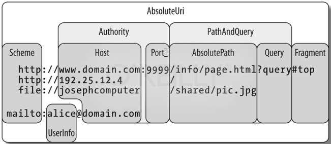

# 7. URI, URL, URN.

## Символьная система

IP-адрес человеку трудно воспринимать и запоминать. *Символьная система*: отдельному узлу сети назначается определенное символьное имя.

Преимущества:

* символьные читаемые имена для человека более удобны, чем числовые значения;
* при изменении IP-адресов имена можно не менять, или, наоборот, произвольно изменить имена при неизменных адресах путем перенастройки системы разрешения имен.

Первые системы символьных имён были «плоские»: администратор локальной сети поддерживал таблицу, в которой сопоставлялось имя и IP-адрес.

**Современная схема** – система доменных имен (Domain Name System, DNS). Имена в DNS образуют иерархически организованное пространство, которое можно представить в виде дерева. Каждому узлу дерева сопоставлена метка длиной до 63 символов. Прописные и заглавные буквы в метках не различаются.

Доменное имя каждого узла представляет собой список меток, разделенных точками. Список начинается слева, с метки текущего узла, в нем перечислены все узлы расположенные вверх по иерархии, вплоть до корня.

DNS обеспечивает ещё и задачу трансляции символьного имени в IP-адрес (и наоборот). Глобально для этого используются сервера имён. На компьютере этим занимается специальная служба DNS.

Алгоритм трансляции имён

1. Поиск соответствия в локальной таблице, хранящейся на компьютере (файл %SystemRoot%\system32\drivers\etc\hosts).
2. Если разрешить имя локально не удалось, выполняются запросы к одному или нескольким серверам DNS, IP-адреса которых указаны в настройках стека протоков TCP/IP на данной машине. Данные на запросы возвращаются в виде ответов.
3. Сервер может дать точные ответы об именах из своей зоны ответственности либо переадресовать запрос к соседнему серверу.

## URI, URL, URN

Универсальный идентификатор ресурса (Uniform Resource Identifier) – строка символов для идентификации (обозначения) произвольного ресурса в глобальной сети.

URI может быть представлен в двух формах:

1. Uniform Resource Locator, URL – это URI, который, помимо идентификации ресурса, предоставляет ещё и информацию о местонахождении ресурса (URL называют веб-адрес): http://example.org/wiki/Main_Page
2. Uniform Resource Name, URN – это URI, который только идентифицирует ресурс в определённом контексте, но не указывает его местонахождения: urn:isbn:0-486-27557-4

## Структура абсолютного URI

1. Схема и : (двоеточие).
2. Специфичная для схемы часть.

Для URL это будет:

* // (два слэша)
* имя хоста (символьное имя компьютера)
* : порт (опционально)
* путь на хосте к ресурсу
* ? параметры запроса к ресурсу (опционально, разделяются &)

