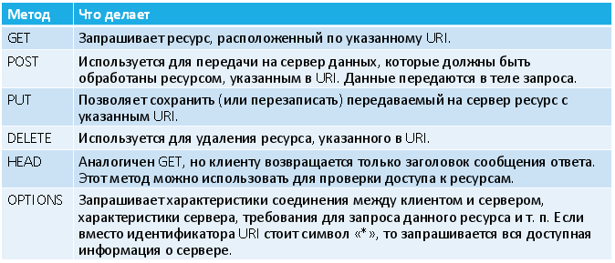
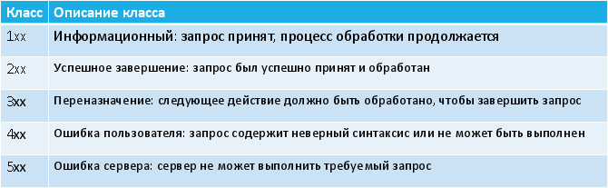

# 8. Протокол HTTP.

**Протокол передачи гипертекста (Hypertext Transfer Protocol)** – протокол прикладного уровня для передачи данных (изначально – в виде HTML-документов, сейчас – для передачи произвольных данных).

* Создан в 1992 году
* Версии: HTTP/0.9 (устарела), HTTP/1.0, HTTP/1.1 (это текущая), HTTP/2 (будущая)
* Описан в RFC 1945, RFC 2616
* Работает поверх протокола TCP, стандартный порт: 80
* Ориентирован на сети «клиент-сервер»
* Работа по протоколу – это обмен текстовыми сообщениями между клиентом и сервером

## HTTP запрос

Структура:

1. Стартовая строка запроса (starting line) – обязательно!
2. Заголовки (headers) – опционально
3. Тело сообщения (message body) – опционально, отделяется пустой строкой

`Метод URI HTTP/Версия`

* Метод – название запроса (определяет действие), одно слово из стандартного списка, заглавными буквами
* URI определяет путь к запрашиваемому ресурсу.
* Версия – пара разделённых точкой цифр. Например: 1.0

Методы:



Примеры стартовых строк:

```http
GET /index.html HTTP/1.1
```

```http
GET /index.html?x=1&y=%D0%9A%D0%BE HTTP/1.0
```

```http
POST /login.php HTTP/1.1
```

**HTTP-заголовки** используются для настройки параметров передачи, описания тела сообщения (если оно есть) и прочих сведений. Записываются в виде `ИмяЗаголовка: Значение`. Есть заголовки, специфичные только для запросов или только для ответов. А есть универсальные заголовки.

Примеры запросов:

```http
GET /wiki/List_of_HTTP_header_fields HTTP/1.1
Host: en.wikipedia.org
Accept-Language: en-US
User-Agent: Mozilla/5.0
```

```http
POST /login.aspx HTTP/1.1
Host: mysite.azure.com
User-Agent: Mozilla/5.0
Content-Length: 22

User=Alex&Pass=123456
```

## HTTP ответ

Структура:

1. Стартовая строка ответа – обязательно!
2. Заголовки – опционально
3. Тело сообщения – опционально, отделяется пустой
строкой

`HTTP/Версия КодСостояния Пояснение`

* Версия – пара разделённых точкой цифр. Например: 1.1
* Код состояния – три цифры. По коду состояния определяется дальнейшее содержимое сообщения и поведение клиента.
* Пояснение – текстовое короткое пояснение кода для пользователя. Не является обязательным.

Коды состояния (Status Codes):



Примеры:

* 100 Continue (Заголовки получены, жду тела запроса)
* 200 OK (Норма)
* 301 Moved Permanently (Ресурс перемещён)
* 400 Bad Request (Ошибка в запросе)
* 403 Forbidden (Запрет доступа)
* 404 Not Found (Не найдено)
* 500 Internal Server Error (Общая ошибка сервера)
* 503 Service Unavailable (Сервер не справляется с обработкой)

Пример HTTP ответа:

```http
HTTP/1.1 301 Moved Permanently
Server: nginx
Date: Mon, 18 May 2015 11:59:09 GMT
Content-Type: text/html
Content-Length: 178
Connection: close
Location: http://www.tut.by/index.html

<html>
<head><title>301 Moved Permanently</title></head>
<body bgcolor="white">
<center><h1>301 Moved Permanently</h1></center>
<hr><center>nginx</center>
</body>
</html>
```