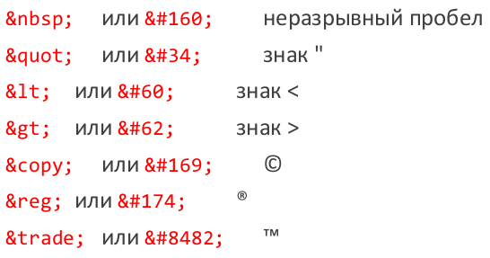

# 9. HTML – история, версии. Синтаксис HTML.

## Определение HTML

**Язык разметки** – набор символов (последовательностей), вставляемых в текст для передачи информации о строении или визуальном выводе текста.

**Язык гипертекстовой разметки (HyperText Markup Language, HTML)** – стандартный язык разметки для документов в World Wide Web. Описывает семантическую структуру страницы для представления (в браузере).

В HTML разметка страницы описывается набором фиксированных элементов, записываемых в виде тегов. Браузер читает разметку и выполняет **рендеринг** – строит визуальное представление страницы (сами теги при этом не отображаются).

## История

* Начало: CERN, Тим Бернерс-Ли, 1980-e.
* Зачем: форматирование научной и технической документации.
* Идея в основе: упрощение языка SGML + поддержка гипертекста.
* Первое публичное упоминание: документ "HTML Tags", опубликован в конце 1991, 18 элементов.

**Internet Engineering Task Force, IETF** – открытое сообщество, занимающееся развитием протоколов и архитектуры Интернета.

**HTML 2.0** – спецификация опубликована IETF в сентябре 1995. Основные нововведения: формы, таблицы, карты изображений.

**World Wide Web Consortium, W3C** – организация, разрабатывающая технологические стандарты для веба. Основана и управляется Бернерсом-Ли (тем самым).

**HTML 3.2** – стандарт принят W3C в январе 1997. Изменилась структура самого стандарта. Из HTML были исключены элементы для построения математических формул. Новые элементы разметки (например, div).

**HTML 4.0** – утвержден как стандарт в апреле 1998. Три варианта стандарта (Strict, Transitional, Frameset). Новые элементы (например: span, frame, thead) и атрибуты.

**HTML 4.01** – декабрь 1999 (its last errata were published May 12, 2001).

**Web Hypertext Application Technology Working Group, WHATWG** – сообщество людей, заинтересованных в развитии Интернета. Основано: 2004 год, Apple, Mozilla Foundation, Opera Software. Причина: W3C отказалось от HTML в пользу XHTML и пренебрегает реальными потребностям пользователей.

* W3C: HTML5 (W3C Recommendation, 28 October 2014).
* WHATWG: HTML Living Standard (Last Updated 5 October 2015).

В целом, стандарты совпадают. Есть небольшие различия.

**HTML5**: Семантическая вёрстка. Новые элементы (мультимедиа, структура страницы), новые атрибуты. Некоторые элементы и атрибуты из старых версий отнесены к устаревшим (касается, в основном, оформления).

## Синтаксис

**HTML-документ** – это текстовый файл, содержащий структурированный набор HTML-элементов. Кроме элементов (с содержимым) – комментарии, пробельные символы. HTML-документы обычно сохраняют в файлах с расширением *.html или *.htm.

HTML-элементы условно делятся на две группы: **контейнеры** и **автономные элементы** (void elements).

**Контейнеры** задаются с помощью трех компонентов: начальный тег, содержимое и конечный тег. Содержимое элемента располагается между начальным и конечным тегами и толкуется браузером согласно правилам, определенным в спецификации HTML. Начальный (открывающий) HTML-тег записывается в угловых скобках (< >) и состоит из имени элемента, за которым может следовать список атрибутов (для многих элементов необязательный). Конечный (закрывающий) HTML-тег имеет вид </имя_элемента>.

**Автономные элементы** не имеют содержимого и конечного тега. При их интерпретации в отображаемый документ обычно вставляется тот или иной объект. Например, тег `` вызывает вставку в документ графического изображения из файла pic.gif.

Некоторые элементы могут вкладываться друг в друга. Пример: вложение элемента b (полужирное начертание) в элемент i (курсив) обеспечит полужирный курсив. `<i>курсив<b>полужирный курсив</b>курсив</i>`

Для большинства элементов можно задавать свойства, называемые атрибутами. Атрибуты в списке отделяются друг от друга одним или несколькими пробелами, либо символами табуляции, либо символами перевода строки. Последовательность записи атрибутов несущественна. Большинство атрибутов употребляются в виде пары `имя атрибута=значение атрибута`. Если значение атрибута представляет собой более чем одно слово или содержит не-латинские символы, его следует заключить в одинарные или двойные кавычки. В спецификации HTML настоятельно рекомендуется использовать кавычки всегда. В спецификации HTML определены логические атрибуты. Если такой атрибут указан, подразумевается, что установлено значение «истина», а отсутствие атрибута означает «ложь». Само значение можно не указывать, достаточно написать только имя атрибута. Разрешается в качестве значения логического атрибута записать пустую строку или имя атрибута. Регистр символов в записи имён элементов и имён атрибутов значения не имеет (в стандарте рекомендуется использовать нижний регистр). Однако, значения атрибутов могут быть регистрозависимыми (например, имена файлов на Linux-сервере).

HTML-документ может содержать комментарии. Комментарии находятся между специальными символами разметки `<!--` и `-->` и могут занимать несколько строк. Браузеры игнорируют текст комментариев при рендеринге документа.

Некоторые символы должны заменяться в тексте HTML-документа специальными последовательностями.

Причины две:

1. Эти символы зарезервированы в HTML (пример: "<").
2. Эти символы отсутствуют на английской клавиатуре.

Спец. последовательности имеют такой вид: `&имя_символа;` или `&#код_символа;`

**код_символа** – это Unicode-код, который записывается как десятичное число или предваряется символом x (или X) и записывается как шестнадцатеричное число.

Примеры:

