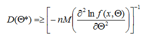

# Оценки

### 1. Что называется – оценкой параметра

**Оценка** - неточное, неполное, приближенное отображение параметра. 

*Получить статистическую оценку* параметра теоретического распределения
означает *найти функцию* от имеющихся результатов наблюдения, которая и
даст приближенное значение искомого параметра.

### 2. Какими св-ми должна обладать оценка? (пояснить их).

Качество оценок характеризуется такими свойствами, как **состоятельность**, **несмещенность**, **эффективность** и **достаточность**.

**Состоятельность** характеризует сходимость по вероятности оценки Θ* к истинному значению параметра Θ при неограниченном увеличении объема выборки n. Для состоятельности оценки достаточно, но не обязательно, чтобы математическое ожидание квадрата отклонения оценки от параметра `M[Θ – Θ*]^2` стремилось к нулю с увеличением объема выборки (здесь и далее символ М означает математическое ожидание). Свойство состоятельности проявляется при неограниченном увеличении n, а при небольших объемах ЭД наличие этого свойства еще недостаточно для применения оценки.

**Несмещенность** характеризует отсутствие систематических (в среднем) отклонений оценки от параметра при любом конечном, в том числе и малом, объеме выборки, т. е. `M[Θ*] = Θ`.
Использование статистической оценки, математическое ожидание которой не равно оцениваемому параметру, приводит к систематическим ошибкам. Не всегда наличие смещения плохо. Оно может быть существенно меньше погрешности регистрации значений параметра или давать дополнительную гарантию выполнения требований к значению параметра (если даже при положительном смещении оценка Θ*  меньше предельно допустимого значения, то несмещенное значение тем более будет отвечать этому условию). В таких ситуациях допустимо применение смещенных оценок, если они вычисляются проще, чем несмещенные. Но даже несмещенная оценка может быть удалена от истинного значения.

**Эффективность** характеризует разброс случайных значений оценки около истинного значения параметра. Среди всех оценок следует выбрать ту, значения которой теснее сконцентрированы около оцениваемого параметра. Для многих применяемых способов оценивания выборочные распределения параметров асимптотически нормальны, поэтому часто мерой эффективности служит дисперсия оценки. В таком понимании эффективная оценка – это оценка с минимальной дисперсией. При неограниченном увеличении n эффективная оценка является и состоятельной. В случае оценивания одного параметра дисперсия несмещенной оценки отвечает условию Рао – Крамера

где f(x, Θ) – плотность распределения варианты; n – количество наблюдений.
Сравнительная эффективность оценки с дисперсией Dn[Θ*] измеряется коэффициентом эффективности `ε =D[Θ*]/Dk[Θ*]`, который не превышает единицы. Чем ближе коэффициент ε к единице, тем эффективнее оценка. Отмеченное ограничение применимо и к дискретным распределениям, если вместо плотности распределения подставить в него функцию вероятности.

**Достаточность** характеризует полноту использования информации, содержащейся в выборке. Другими словами, оценка Θ* будет достаточной, если все другие независимые оценки на основе данной выборки не дают дополнительной информации об оцениваемом параметре. Эффективная оценка обязательно является и достаточной.

### 3. Точечной оценки параметра:

### 4. Определение

**Доверительная вероятность** – это вероятность не совершить ошибку первого рода и принять верную гипотезу Н0. 

**Доверительным** называют интервал, который покрывает неизвестный параметр с заданной надёжностью.

**Доверительный интервал** – интервал θ0 – θ1 (θ0 < θ1), который накрывает истинное значение неизвестного скалярного параметра Θ.

### 5. При увеличении доверительной вероятности, доверительный интервал увеличивается? («ДА/НЕТ» -  доказать на формулах).

**ДА**

### 6. Какие оценки называют а) «точечными» оценками    б) интервальными оценками?

**Точечными** называют такие оценки, которые характеризуются одним числом. 
**Интервальные** оценки задаются двумя числами, определяющими вероятный диапазон возможного значения параметра.

### 7. Если есть «точечная» оценка, зачем нужна интервальная оценка?

При малых объемах выборки *точечные* оценки могут значительно отличаться от истинных значений параметров, что делает их непригодными для использования, и поэтому их применяют при большом объеме выборки.
*Интервальные* оценки являются более полными и надежными по сравнению с точечными, они применяются как для больших, так и для малых выборок. 